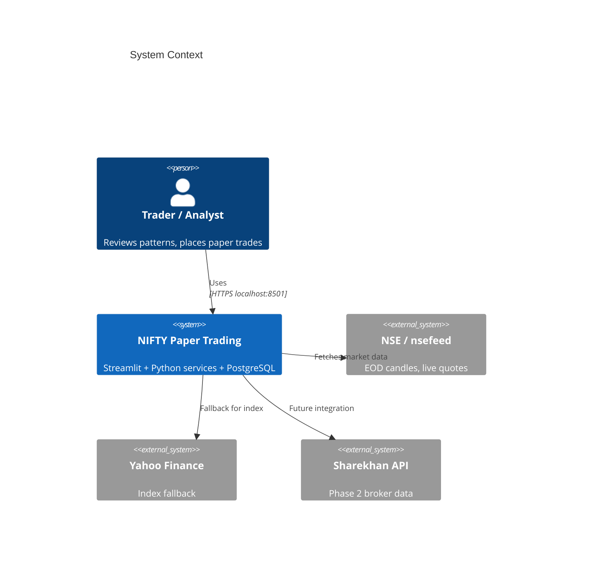
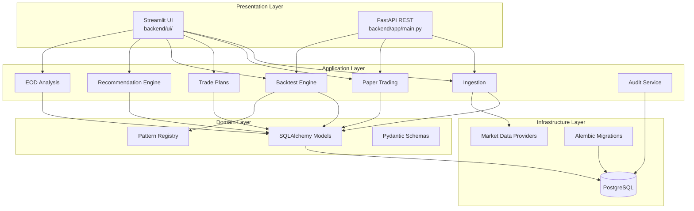
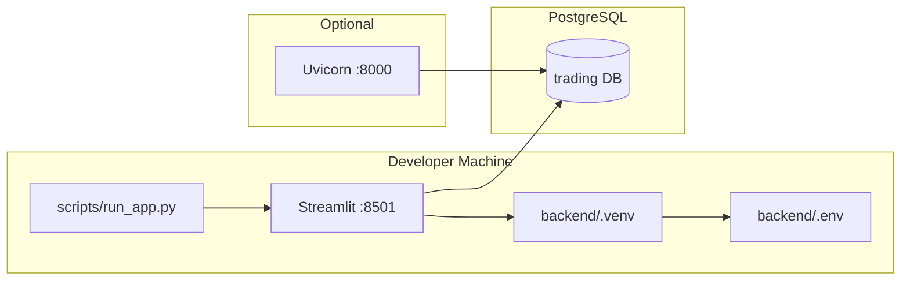
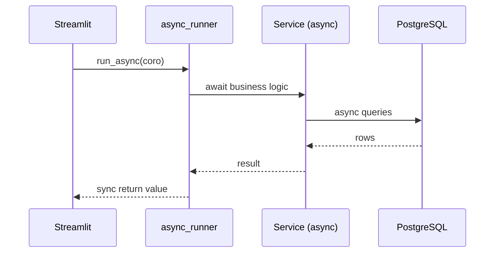

# Architecture Overview

High-level system design for the NIFTY Paper Trading platform.

## Design goals

1. **Paper trading first** — simulate orders, positions, and P&L without broker integration
2. **Pluggable market data** — swap NSE, yfinance, or Sharekhan via `DATA_PROVIDER`
3. **Pattern-driven decisions** — 79 registered technical/candlestick/chart patterns for backtest and recommendations
4. **Single-process UI** — Streamlit dashboard as primary interface; FastAPI optional
5. **Auditability** — all major actions logged to PostgreSQL

## System context

## Layered architecture

## Component map

| Layer | Path | Responsibility |
|-------|------|----------------|
| **UI** | `backend/ui/` | Streamlit pages, background jobs, on-demand chart dialogs |
| **API** | `backend/app/api/routes/` | REST endpoints for instruments, paper trading, backtest, admin |
| **Services** | `backend/app/services/` | Business logic (24 modules) |
| **Providers** | `backend/app/providers/` | External market data abstraction |
| **Strategies** | `backend/app/strategies/` | Pattern registry + 79 pattern implementations |
| **Models** | `backend/app/models/` | SQLAlchemy ORM entities |
| **DB** | `backend/app/db/` | Async session factory |
| **Jobs** | `backend/app/jobs/` | CLI market sync (`sync_market_data.py`) |
| **Scripts** | `scripts/` | Setup, startup, run app |
| **Tests** | `backend/tests/` | Integration + post-deploy smoke |

## Deployment topology (local)

There is no container orchestration. One Python process serves Streamlit; PostgreSQL runs as a local or remote service.

## Runtime processes

| Process | Port | Entry | Purpose |
|---------|------|-------|---------|
| Streamlit | 8501 | `scripts/run_app.py` | Primary UI |
| FastAPI | 8000 | `uvicorn app.main:app` | Optional REST API |
| PostgreSQL | 5432 | OS service | Data persistence |
| CLI sync | — | `python -m app.jobs.sync_market_data` | Cron-style EOD sync |

## Async execution model

- **FastAPI** and **services** use **async SQLAlchemy** (`asyncpg` driver)
- **Streamlit** is synchronous; `ui/async_runner.py` bridges coroutines
- **Background jobs** (`ui/background_jobs.py`) run sync/market/backtest work in threads to avoid blocking the UI

## Data domains

| Domain | Tables | Primary consumers |
|--------|--------|-------------------|
| **Market** | `instruments`, `ohlcv_candles` | Charts, backtest, sync |
| **Paper trading** | `paper_accounts`, `paper_orders`, `paper_positions`, `paper_trades` | Trading tab, API |
| **Bracket plans** | `paper_trade_plans` | Recommendations, live/EOD fills |
| **Backtest** | `backtest_runs`, `backtest_pattern_scores`, `backtest_stock_scores` | Pattern backtest tab |
| **Recommendations** | `recommendation_snapshots` | Recommendations tab cache |
| **Audit** | `audit_logs` | Admin API, troubleshooting |

## Universe concept

The app tracks multiple **symbol universes** (defined in `backend/app/data/`):

| Universe | File | Use |
|----------|------|-----|
| NIFTY50 | `nifty50.json` | Legacy 50 constituents |
| NIFTY250 | `nifty_universe_cache.json` | Default sync + backtest universe |
| Backtest subset | `backtest_universe.json` | Fixed 15-stock backtest panel |
| Recommendation config | `recommendation_universe.json` | Filters, boosts, price buckets (scan universe = NIFTY250) |

Configured via `MARKET_DATA_UNIVERSE` and `DEFAULT_SIMULATION_UNIVERSE`.

## Security model (local dev)

- No authentication on Streamlit or FastAPI (personal/local use)
- Credentials in `backend/.env` (gitignored)
- CORS is permissive on FastAPI for local development
- Audit logs capture actions for post-hoc review

Production hardening (auth, HTTPS, network isolation) is out of scope for the current codebase.

## Extension points

| Extension | How |
|-----------|-----|
| New pattern | Add file under `app/strategies/patterns/` with `@register_pattern` |
| New data provider | Implement `MarketDataProvider`; register in `providers/__init__.py` |
| New UI page | Add render function in `ui/`; wire in `dashboard.py` sidebar |
| New API route | Add router under `app/api/routes/`; include in `main.py` |
| New DB entity | Model + Alembic migration |

## Related documents

- [Data model](04-data-model.md) — schema details
- [Data flows](05-data-flows.md) — workflow diagrams
- [Services reference](06-services-reference.md) — module catalog
- [Streamlit UI](08-streamlit-ui.md) — page breakdown

Next: [Data model](04-data-model.md)
