# Data Flows

End-to-end workflows with diagrams for the major system paths.

## 1. Application startup

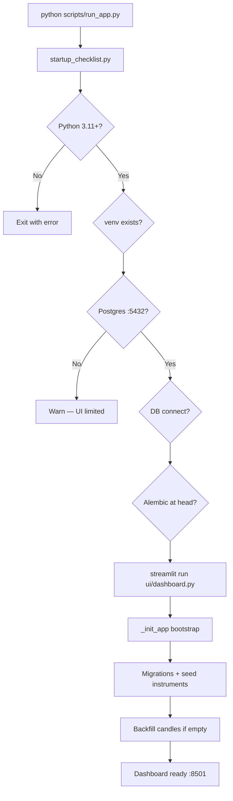

**Files:** `scripts/run_app.py`, `scripts/startup_checklist.py`, `backend/ui/dashboard.py`

---

## 2. Market data sync

Triggered by: sidebar **Refresh market data**, `POST /api/admin/sync`, or CLI `python -m app.jobs.sync_market_data`.

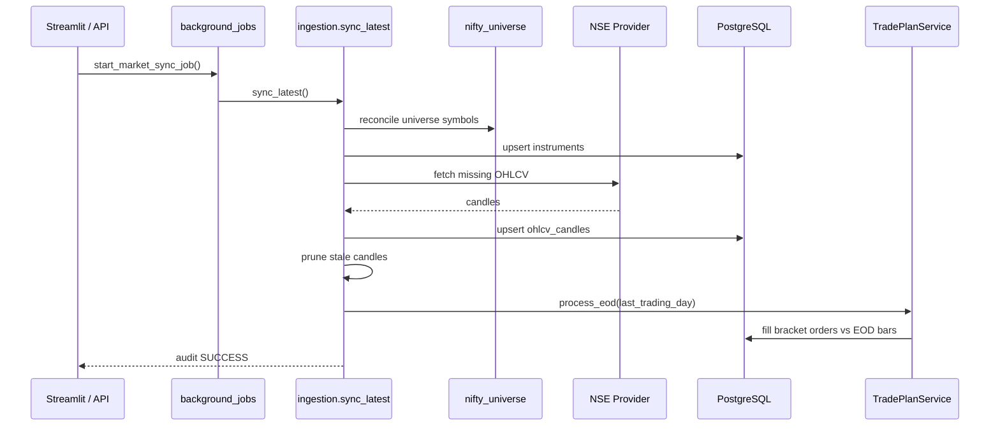

**Key behaviors:**

- Universe resolved from `MARKET_DATA_UNIVERSE` (default `NIFTY250`) — same set used for recommendations, backtests, and sync
- Provider selected by `DATA_PROVIDER` (`nse` default)
- After sync, EOD bracket processing runs for the last completed trading day
- Entire operation audited as `ingestion.sync_latest`

---

## 3. Paper trading (manual orders)

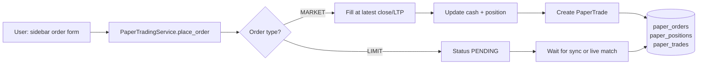

**Budget check:** BUY orders validated against `daily_trading_budget_inr` via `budget_portfolio.validate_buy_against_budget()`.

**Sell validation:** Rejected if insufficient position quantity.

---

## 4. Bracket trade plan lifecycle

Created from **Recommendations** tab → **Place trade** / **Place order for all**.

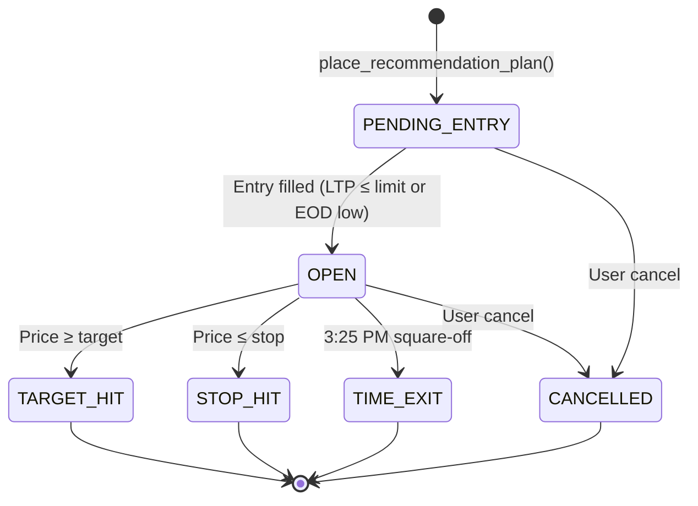

### Intraday (live polling)

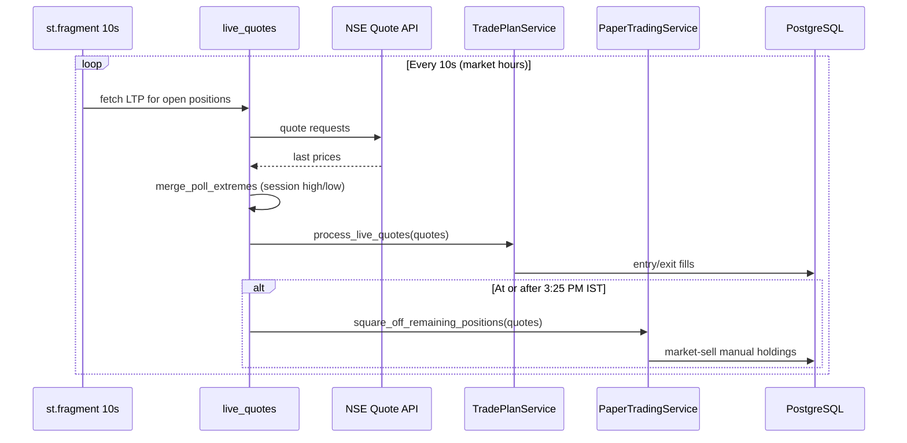

Live polling only runs when:

- Toggle **Live polling (10s)** is ON
- Current time is within NSE session (9:15–16:30 IST)
- Day is a trading day

### Bracket catch-up (manual)

```mermaid
sequenceDiagram
    participant UI as Trading Positions view
    participant H as ui/helpers
    participant TP as TradePlanService
    participant NSE as NSE / live quotes
    participant DB as PostgreSQL

    UI->>H: Reconcile brackets button
    H->>H: _reconcile_brackets_if_needed(force=True)
    H->>TP: reconcile_session_brackets_after_downtime()
    TP->>DB: match pending limits; sync entries
    TP->>NSE: session OHLC + live quotes
    TP->>DB: target/stop/entry fills; stale EOD close
    H->>H: record_reconcile_success()
```

Automatic reconcile on Trading tab load was removed for performance — use the manual button or CLI job.

### Orders tab (session view + cleanup)

```mermaid
sequenceDiagram
    participant UI as Trading → Orders tab
    participant H as ui/helpers
    participant TP as TradePlanService
    participant PT as PaperTradingService
    participant DB as PostgreSQL

    UI->>H: _cleanup_duplicate_session_orders()
    H->>TP: cleanup_duplicate_session_plans()
    TP->>DB: cancel duplicate plans/orders; undo duplicate fills
    UI->>H: _orders(session_date=today)
    H->>PT: list_orders (exclude CANCELLED in UI)
    UI->>H: _load_order_bracket_context()
    H->>DB: bracket target buy/sell per plan
    opt Live polling + market hours
        UI->>H: _fetch_live_quotes(symbols)
    end
```

---

## 5. Pattern backtest

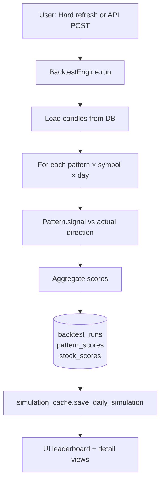

**Scoring example:** On a given day, if 12 of 15 stocks match the pattern's predicted direction, daily score = 12/15.

**Cache:** One cached snapshot per `(simulation_date, universe)` in `report_payload`.

---

## 6. Recommendation engine

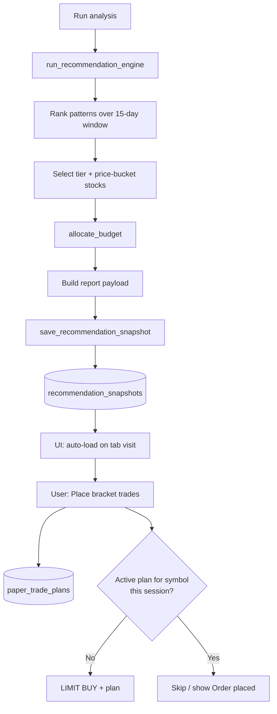

**Duplicate prevention:** `place_recommendation_plan()` consults `_find_active_session_plan()` before creating orders. **Place order for all** passes only symbols not in `_load_allocation_trade_plan_state()`.

**Cleanup:** Opening Trading → Orders runs `cleanup_duplicate_session_plans()` to remove legacy duplicate bracket entries from accidental double placement.

---

## 6.1 Mid-day recommendation analysis

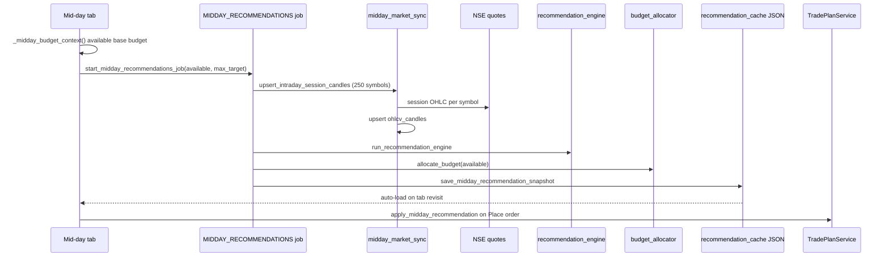

**Budget:** `available = morning_budget − invested_open − |realized_P&L_today|` — profits are not reinvested (`compute_base_budget_available`).

**Morning comparison:** Loads DB morning snapshot via `load_cached_recommendations_for_ui()`; does not overwrite it.

---

## 7. EOD analysis

Two levels of EOD reporting:

| Level | Source | UI location |
|-------|--------|-------------|
| Basic | `TradePlanService.build_eod_report()` | Trading tab snippet |
| Rich | `EodTradeAnalysisService` | Analysis & EOD tab |

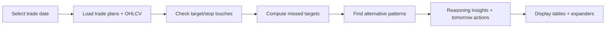

Uses historical bars to determine whether intraday high/low touched target or stop, and whether close beat target.

**As-of date (intraday):** On the **Trading** tab, when the market session is still in progress, EOD snippets pass `as_of_date=active_market_session_date()` so metrics reflect today's session rather than the last *completed* trading day. The **Analysis & EOD** tab uses the selected trade date directly (`eval_date = as_of_date or trade_date` in `EodTradeAnalysisService.build_report()`).

After **3:45 PM IST** on the trade date, the report includes **NIFTY250 — profitable closes not recommended**: universe stocks that closed up but were not in that day's recommendation picks (`EodTradeAnalysisService` + `recommended_symbols_for_prediction_date()`).

---

## 8. Audit logging

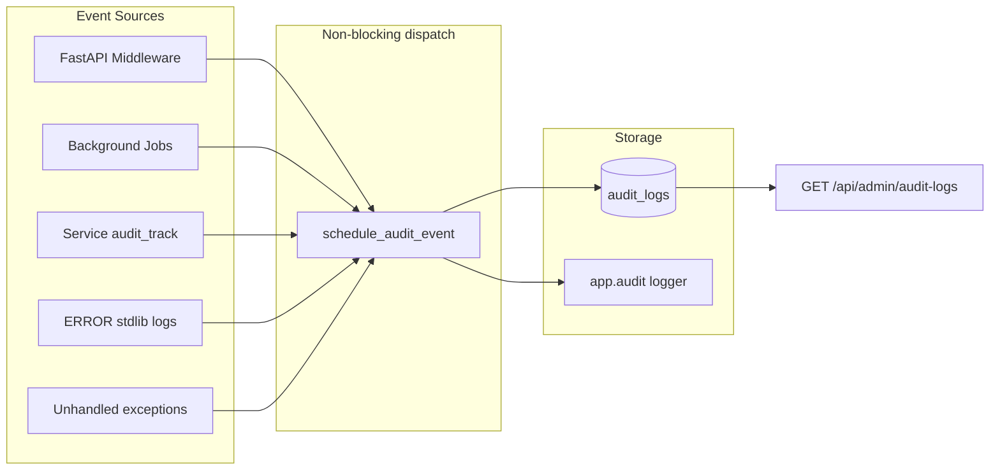

Every HTTP request (when enabled), market sync, backtest run, and recommendation job writes an audit row with duration, status, and optional traceback. Dispatch is **fire-and-forget** — persistence failures are logged to stderr only.

---

## 9. FastAPI request path (optional)

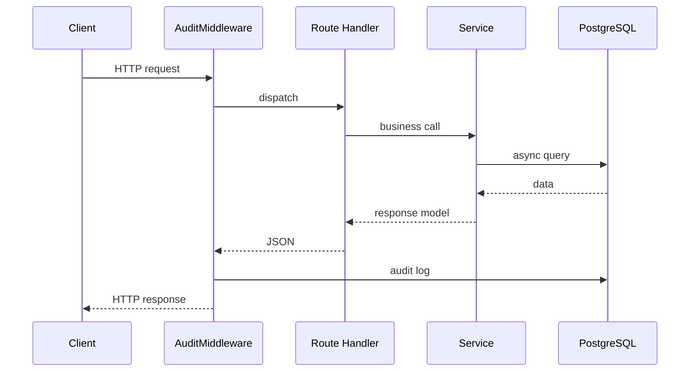

---

## Flow summary table

| Flow | Trigger | Primary service | Output |
|------|---------|-----------------|--------|
| Startup | `run_app.py` | bootstrap, alembic | Running UI |
| Market sync | Refresh button / API / CLI | `ingestion.sync_latest` | Updated candles; optional paper history prune |
| Manual order | Sidebar form | `PaperTradingService` | Order + position |
| Bracket plan | Recommendations / Mid-day | `TradePlanService` | Trade plan row |
| Live fills | 10s polling | `process_live_quotes` + poll session high/low + `square_off_remaining_positions` | Entry/exit orders; EOD square-off |
| EOD fills | Post-sync | `process_eod` | Bracket completions + remaining holdings at close |
| Backtest | Hard refresh | `BacktestEngine` | Score tables |
| Recommendations | Run analysis | `recommendation_engine` | Snapshot JSON |
| Mid-day analysis | Mid-day tab (11:45+ IST) | `midday_market_sync` + engine | JSON file cache |
| EOD report | Tab select | `EodTradeAnalysisService` | Analysis report |
| Paper trend | Paper trading trend tab | `PaperTradingTrendService` | Daily/cumulative P&L report |

Next: [Services reference](06-services-reference.md)
