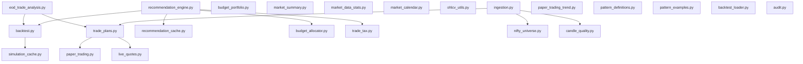

# Services Reference

Catalog of business logic modules in `backend/app/services/`.

## Service dependency map

---

## Core services

### `ingestion.py`

**Purpose:** Market data synchronization pipeline.

| Function | Description |
|----------|-------------|
| `sync_latest()` | Full sync: reconcile universe → backfill candles → prune → EOD bracket pass |
| `backfill_candles()` | Fetch and upsert OHLCV for active instruments |
| `seed_instruments()` | Load symbols from JSON manifests |
| `ensure_paper_account()` | Create default paper account if missing |

**Called by:** UI market sync job, `POST /api/admin/sync`, CLI job

---

### `paper_trading.py`

**Purpose:** Virtual order execution and portfolio management.

| Capability | Details |
|------------|---------|
| Place order | MARKET (immediate fill) or LIMIT (pending) |
| Cancel order | Pending LIMIT orders only |
| Undo filled BUY | `undo_filled_buy_entry()` — reverse duplicate entry fills during bracket cleanup |
| Positions | Weighted average cost tracking; **source** derived from active trade plans |
| Trades | Ledger with realized P&L on sells |
| Account summary | Cash, invested, total value, P&L |
| Square-off | `square_off_remaining_positions()` — market-sell all holdings at/after 3:25 PM IST |
| EOD square-off | `square_off_remaining_at_close()` — close remaining holdings at session close |
| Session filters | `list_orders(session_date)`, `list_trades(session_date)` for today-only UI |

**Class:** `PaperTradingService`

---

### `trade_plans.py`

**Purpose:** Bracket order lifecycle (entry + target + stop).

| Method | Description |
|--------|-------------|
| `place_recommendation_plan()` | Create LIMIT buy + plan with target/stop; rejects duplicate session plans |
| `apply_midday_recommendation()` | Mid-day: new bracket, calibrate pending limit, or update open target/stop |
| `_find_active_session_plan()` | Detect existing active plan for symbol in current recommendation/trading session |
| `cleanup_duplicate_session_plans()` | Cancel/reverse duplicate bracket entries for the same symbol on one session day |
| `process_eod()` | Match plans against daily OHLC high/low; square off remaining at close |
| `process_live_quotes()` | Intraday entry/exit via LTP; uses poll + NSE session high/low (`observed_high`/`observed_low`); `TIME_EXIT` at 3:25 PM IST |
| `reconcile_open_plans_with_nse_day_ohlc()` | Match OPEN plans against NSE session OHLC (one-off / catch-up) |
| `reconcile_session_brackets_after_downtime()` | Full catch-up: pending limits, stale sessions, NSE OHLC, live quotes, 3:25 square-off |
| `build_eod_report()` | Basic EOD summary for Trading tab |

**Class:** `TradePlanService`

---

### `backtest.py`

**Purpose:** Pattern evaluation engine over historical candles.

| Capability | Details |
|------------|---------|
| Run backtest | Evaluate all patterns × universe × eval days |
| Score patterns | Rank by hit rate and daily accuracy |
| Persist results | Write to backtest_* tables |
| Today's prediction | Latest-day signal matrix |

**Class:** `BacktestEngine`

---

### `recommendation_engine.py`

**Purpose:** Generate daily stock picks from top patterns.

| Step | Description |
|------|-------------|
| Pattern ranking | 15-day rolling performance |
| Stock selection | Tier (cap) + price bucket filters |
| Tax adjustment | Net profit after STCG/STT/stamp/brokerage |
| Report assembly | Structured payload for UI |

**Entry:** `run_recommendation_engine()`

---

### `recommendation_cache.py`

**Purpose:** Persist and reload recommendation reports.

| Function | Description |
|----------|-------------|
| `save_recommendation_snapshot()` | Upsert morning JSON by `analysis_date` (PostgreSQL) |
| `load_cached_recommendations()` | Load latest or by `prediction_date` |
| `save_midday_recommendation_snapshot()` | Persist mid-day run to daily JSON file |
| `load_midday_cached_recommendations_for_ui()` | Load today's mid-day run from file |
| `recommended_symbols_for_prediction_date()` | Symbol set from snapshot for NIFTY250 / EOD missed-mover analysis |

**Storage:** `recommendation_snapshots` table (morning); `backend/app/data/midday_recommendation_snapshot.json` (mid-day, gitignored)

---

## Supporting services

### `budget_allocator.py`

Splits daily budget across recommendation lines by confidence weighting. Returns `BudgetAllocationReport` with `AllocationLine` objects (shares, INR amounts, tax-adjusted profit).

| Behavior | Description |
|----------|-------------|
| Tier split | Configurable `tier_budget_split_pct` (default ~33% per cap tier) |
| Invalid bracket skip | Primary picks where `target ≤ entry` are skipped (`skipped_invalid`) |
| Same-tier backfill | When a primary pick is invalid, substitutes an alternate from the same cap tier via `all_report_recommendations()` |
| UI warnings | `backfilled_symbols` lists alternates used in the final allocation |

### `bracket_utils.py`

Shared bracket level validation:

| Function | Rule |
|----------|------|
| `is_valid_bracket_levels(buy, target, stop)` | Returns true only when `stop < buy < target` |

Used by `budget_allocator`, Recommendations **Place trade** guards, and `TradePlanService.place_recommendation_plan()`.

### `bracket_reconcile_state.py`

Persists bracket catch-up timestamps across UI restarts (file: `backend/app/data/bracket_reconcile_state.json`).

| Function | Description |
|----------|-------------|
| `should_auto_reconcile()` | True when never run, session day changed, or last reconcile > 5 min ago (used by tests/CLI — **not** Trading tab auto-load) |
| `record_reconcile_success()` | Write `last_reconcile_at` after successful catch-up |
| `record_live_poll()` | Write `last_live_poll_at` after successful live quote fetch |
| `format_reconcile_notice()` | Human-readable summary for UI banner |

### `nifty250_index.py`

Equal-weight composite index from NIFTY250 constituent OHLCV in the local DB.

| Function | Description |
|----------|-------------|
| `build_nifty250_composite_candles()` | Cross-sectional mean OHLC over last N sessions |
| `composite_change_pct()` | Day-over-day % change from last two composite closes |
| `load_nifty250_composite_candles()` | Async loader (service/tests only; **not** shown on Trading tab) |

### `budget_portfolio.py`

- Portfolio view vs daily budget (`compute_budget_view`)
- **Mid-day deployable cash** (`compute_base_budget_available`) — morning budget minus open cost minus |today's realized P&L| (profits not reinvested)
- Validates BUY orders against remaining budget (`validate_buy_against_budget`, optional `session_realized_pnl` for mid-day)
- Legacy account normalization
- **Total value helpers** (Trading tab):
  - `portfolio_total_at_cost(invested, cash, after_tax_realized)` — invested + cash + after-tax realized P&L
  - `portfolio_total_with_unrealized(..., unrealized_pnl)` — adds open-position mark-to-market

### `broker_delivery_profiles.py`

Frozen dataclass profiles for **NSE equity delivery** charge comparison:

| Profile | Brokerage | Exchange txn | DP on sell |
|---------|-----------|--------------|------------|
| `SHAREKHAN_DELIVERY` | 0.30%/side (min ₹0.01/share) | 0.00297% | ₹0 |
| `ZERODHA_DELIVERY` | ₹0 | 0.00307% | ₹15.34/scrip |

Used by `trade_tax.summarize_sell_trades_dual_broker()` for side-by-side portfolio summary on the Trading tab.

### `midday_market_sync.py`

Upserts **partial session OHLC** for today's trade date into `ohlcv_candles` before mid-day engine rerun.

| Function | Description |
|----------|-------------|
| `upsert_intraday_session_candles()` | Fetch session OHLC per sync-universe symbol; progress callback `(index, total, message)` |

### `midday_recommendations.py`

Builds comparison rows between mid-day allocation and morning snapshot for the UI table.

| Type | Description |
|------|-------------|
| `MiddayActionKind` | `NEW`, `PENDING_CALIBRATE`, `OPEN_CALIBRATE` |
| `build_midday_comparison_rows()` | Per-symbol morning vs mid-day levels + plan status |

### `trade_tax.py`

Computes Indian equity delivery transaction costs and after-tax P&L:

| Export | Purpose |
|--------|---------|
| `compute_net_profit()` | Per-leg breakdown (STT, stamp, brokerage, exchange, SEBI, GST, DP, STCG) |
| `summarize_sell_trades_after_tax()` | Aggregate closed sells for one broker profile |
| `DualBrokerRealizedPnlSummary` | `{ sharekhan, zerodha }` summaries for UI comparison |
| `summarize_sell_trades_dual_broker()` | Dual profile aggregate from `(qty, buy, sell)` tuples |

Statutory rates (STCG, STT, stamp) come from `get_applicable_rates()`; broker-specific rates from `broker_delivery_profiles.py`. Recommendations use Sharekhan-aligned defaults; the Trading tab shows both brokers.

Paper trading fills do **not** deduct taxes from cash (tax is informational in recommendations and portfolio summary).

### `applicable_rates.py`

Fetches, persists, and serves Indian equity statutory rates:

| Function | Purpose |
|----------|---------|
| `get_applicable_rates()` | Cached rates (JSON → Settings fallback) |
| `refresh_applicable_rates()` | Fetch from Zerodha/ClearTax/Bajaj HTML, persist |
| `refresh_due()` | True when not yet refreshed today (IST) |
| `load_persisted_rates()` / `save_persisted_rates()` | `app/data/applicable_rates.json` |

Scheduled via `ui/scheduled_rates_refresh.py` (9 AM IST or first daily app start) and `app/jobs/refresh_applicable_rates.py`.

### `live_quotes.py`

Fetches NSE last traded price for symbols with open positions or pending entry plans. Does **not** persist quotes as OHLCV.

| Function / type | Description |
|-----------------|-------------|
| `fetch_live_quotes()` | Batch LTP fetch from NSE; enriches open/prev close from OHLCV when missing |
| `PositionLiveQuote` | UI cache shape: `last_price`, `today_open`, `prev_close`, `session_high` |
| `fetch_position_live_quotes()` | Returns `PositionLiveQuote` dict for Positions table |
| `live_quote_ltp()` | Reads LTP from cache dict or legacy float |
| `merge_poll_extremes()` | Accumulates min/max LTP across 10s polls into `SessionQuote.poll_low` / `poll_high` |
| `merge_session_extremes()` | Alias for poll extreme merge |
| `reset_poll_extremes()` | Clears session poll tracking (new session or restart) |

Bracket live fills use **poll-based** session high/low (min/max LTP seen across polls), seeded from NSE day high when available — not NSE full-day `dayHigh`/`dayLow` alone.

### `market_summary.py`

Latest close and day-over-day change % for all active instruments.

### `market_data_stats.py`

UI statistics: candle date ranges, last simulation date, top patterns table.

### `market_calendar.py`

IST market session helpers:

| Function | Purpose |
|----------|---------|
| `is_live_quote_session()` | 9:15–16:30 IST on trading days |
| `is_square_off_window()` | 3:25–16:30 IST — force-close open positions |
| `is_missed_profitable_analysis_ready()` | After 3:45 PM IST — NIFTY250 missed-mover analysis |
| `is_trading_day()` / `is_nse_holiday()` | Weekday + holiday check (reads `nse_trading_holidays.json`) |
| `get_next_trading_day()` / `get_previous_trading_day()` | Skip weekends and NSE holidays |
| `recommendation_prediction_date()` | Target session for recommendations (after 4:30 PM IST → next trading day) |
| `current_session_date()` | IST calendar date for Orders/Trades tabs |
| `active_market_session_date()` | Trade date for NIFTY250 day moves and recommendation matching |
| `last_completed_trading_day()` | Previous trading session date |

Constants: `NSE_SQUARE_OFF` (15:25), `NSE_MISSED_PROFITABLE_CUTOFF` (15:45), `NSE_EOD_CUTOFF` (16:30).

### `nifty_universe.py`

Resolves NIFTY50/NIFTY250 symbol lists from NSE + local cache file (`nifty_universe_cache.json`).

### `candle_quality.py`

Validates OHLCV series integrity; NSE history fetch fallback for gaps.

### `ohlcv_utils.py`

Decimal sanitization, DataFrame cleanup for chart rendering.

### `eod_trade_analysis.py`

Rich EOD analysis service:

- Trade breakdown metrics
- Missed targets analysis
- Alternative pattern suggestions
- Reasoning engine insights
- Tomorrow action recommendations

**Class:** `EodTradeAnalysisService`

### `paper_trading_trend.py`

Aggregates closed paper trades into portfolio performance reports:

- Daily P&L trend and cumulative curve
- Win/loss counts, profitable-day rate
- Per-pattern performance breakdown
- Closed trade ledger with Rec/Manual source

**Class:** `PaperTradingTrendService` — aggregates closed trades within the rolling retention window (default 30 days).

### `paper_trading_retention.py`

| Function | Description |
|----------|-------------|
| `prune_paper_trading_history()` | Delete terminal plans, trades, and orders older than retention window |
| `prune_paper_trading_history_if_due()` | Run prune after 3:45 PM IST (called from market sync) |
| `filter_closed_within_window()` | Filter trend rows to rolling window |

Active bracket plans (`PENDING_ENTRY` / `OPEN`) are never pruned.

### `pattern_definitions.py`

Loads pattern metadata from `app/data/pattern_definitions.json` for the Pattern Definitions UI tab.

### `pattern_examples.py`

Generates synthetic OHLC examples for pattern visualization charts.

### `simulation_cache.py`

Serialize/deserialize daily backtest snapshots to `backtest_runs.report_payload`. Avoids re-running full simulation on every page load.

### `backtest_loader.py`

Streamlit-safe factory for `BacktestEngine` (handles module reload / stale imports).

---

## Audit services (ABC framework)

### `audit.py` — public API

| Function | Description |
|----------|-------------|
| `record_audit()` | Build `AuditEvent`, delegate to `AuditWriter` |
| `list_audit_logs()` | Query via `AuditReader` |
| `audit_track()` / `audit_track_sync()` | Timed context managers with exception capture |

### `audit_backends/` — pluggable writers

| Module | Type | Description |
|--------|------|-------------|
| `base.py` | `AuditEvent`, `AuditWriter` (ABC), `AuditReader` (ABC) | Core contracts |
| `postgres.py` | `PostgresAuditWriter` | Persist to `audit_logs` |
| `logging_backend.py` | `LoggingAuditWriter` | Emit to `app.audit` logger |
| `composite.py` | `CompositeAuditWriter` | Fan-out (default backend) |
| `registry.py` | `get_audit_writer()`, `build_audit_writer()` | Factory / singleton |

### `audit_handlers.py`

| Hook | Action prefix | Captures |
|------|---------------|----------|
| `AuditLoggingHandler` | `log.<logger>` | Root logger ERROR/CRITICAL (skips `app.audit.*`) |
| `sys.excepthook` | `sys.unhandled_exception` | Uncaught exceptions |
| `asyncio` handler | `asyncio.unhandled_exception` | Async loop errors |
| `install_audit_hooks()` | — | One-time install (FastAPI startup, Streamlit `ensure_ready()`) |
| `reset_audit_hooks_for_tests()` | — | Test helper to restore stdlib hooks |

### `audit_dispatch.py`

| Function | Description |
|----------|-------------|
| `schedule_audit_event()` | Fire-and-forget queue (async task, background thread, or Streamlit loop) |
| `_persist_event()` | Writes via `get_audit_writer()`; never raises |
| `flush_pending_audit_tasks()` | Test helper — await queued audit tasks |

### `audit_decorators.py`

| Decorator | Description |
|-----------|-------------|
| `@audited(action, component)` | Wrap sync/async functions with `audit_track` (optional; services use `audit_track` directly) |

### `audit_types.py`

Enums: `AuditStatus`, `AuditComponent`, `AuditSoftFailure`

---

## UI bridge modules (not in services/ but related)

| Module | Path | Role |
|--------|------|------|
| `helpers.py` | `backend/ui/` | Async wrappers: orders/trades, bracket context, `_reconcile_brackets_if_needed`, `_cleanup_duplicate_session_orders`, EOD/backtest |
| `position_intraday_chart.py` | `backend/ui/` | Intraday position chart modal dialog |
| `symbol_history_chart.py` | `backend/ui/` | Historical OHLC chart modal from sidebar **Show chart** |
| `async_runner.py` | `backend/ui/` | Run coroutines from sync Streamlit |
| `background_jobs.py` | `backend/ui/` | Threaded job runner for long tasks |
| `job_api.py` | `backend/ui/` | Job start/cancel/poll API for sidebar |

## Background job types

Defined in `ui/background_jobs.py`:

| Job type | Service invoked |
|----------|-----------------|
| `MARKET_SYNC` | `ingestion.sync_latest` |
| `SIM_BACKTEST` | `BacktestEngine.run` |
| `TODAY_PREDICTION` | Latest-day prediction |
| `RECOMMENDATIONS` | `run_recommendation_engine` |

## CLI / ops jobs

| Module | Command | Purpose |
|--------|---------|---------|
| `app/jobs/reconcile_session_targets.py` | `python -m app.jobs.reconcile_session_targets` | CLI-only NSE day OHLC catch-up for OPEN plans (UI catch-up is preferred during market hours) |
| `app/jobs/refresh_applicable_rates.py` | `python -m app.jobs.refresh_applicable_rates` | Refresh STCG/STT/stamp rates |

Next: [API reference](07-api-reference.md)
