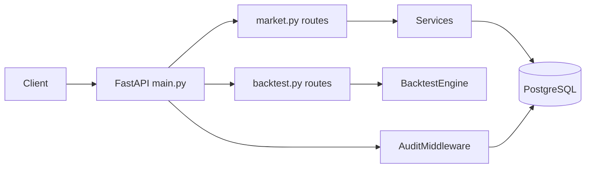

# API Reference

Optional REST API provided by FastAPI. The Streamlit UI is the primary interface; the API enables programmatic access and post-deploy smoke tests.

## Base URLs

| Environment | URL |
|-------------|-----|
| Local | http://localhost:8000 |
| OpenAPI docs | http://localhost:8000/docs |
| ReDoc | http://localhost:8000/redoc |

## Start the API

```bash
cd backend
source .venv/bin/activate
uvicorn app.main:app --reload --port 8000
```

## Middleware

| Middleware | Behavior |
|------------|----------|
| CORS | Permissive (all origins) for local dev |
| AuditMiddleware | Logs each request to `audit_logs` when `AUDIT_LOG_API_REQUESTS=true` |

---

## Health

### `GET /health`

Returns service health status.

```json
{"status": "ok"}
```

---

## Market & instruments

### `GET /api/instruments`

List all active instruments.

**Response:** Array of instrument objects (symbol, name, type, exchange).

### `GET /api/instruments/{symbol}/candles`

OHLCV history for a symbol.

| Query param | Type | Default | Description |
|-------------|------|---------|-------------|
| `days` | int | 30 | Number of trading days |

**Response:** Array of candle objects (date, open, high, low, close, volume).

### `GET /api/market/summary`

Latest prices and change % for all instruments.

---

## Paper trading

### `GET /api/paper/account`

Portfolio summary: cash balance, invested value, total P&L.

### `GET /api/paper/positions`

Open positions with quantity, avg cost, mark price, unrealized P&L, and **`source`** (`MANUAL` or `RECOMMENDATION` — derived from active trade plans, not stored in DB).

### `GET /api/paper/orders`

Order history (all statuses). The Streamlit UI filters to the current IST session date; the API returns full history unless filtered by query params.

### `GET /api/paper/trades`

Executed trade ledger with realized P&L. The Streamlit UI filters to the current IST session date; the API returns full history unless filtered.

### `POST /api/paper/orders`

Place a new order.

**Request body:**

```json
{
  "symbol": "TCS",
  "side": "BUY",
  "order_type": "MARKET",
  "quantity": 10,
  "limit_price": null
}
```

| Field | Required | Values |
|-------|----------|--------|
| `symbol` | Yes | Active instrument symbol |
| `side` | Yes | `BUY`, `SELL` |
| `order_type` | Yes | `MARKET`, `LIMIT` |
| `quantity` | Yes | Positive integer |
| `limit_price` | For LIMIT | Decimal price |

### `DELETE /api/paper/orders/{order_id}`

Cancel a pending LIMIT order.

---

## Admin

### `POST /api/admin/sync`

Trigger full market data sync (same as UI **Refresh market data**).

**Response:** Sync summary (instruments updated, candles fetched).

### `GET /api/admin/audit-logs`

Query audit logs.

| Query param | Description |
|-------------|-------------|
| `limit` | Max rows (default 50) |
| `status` | Filter by status (e.g. `FAILED`) |
| `action_prefix` | Filter by action prefix (e.g. `job.`) |
| `component` | Filter by component |

---

## Backtest

### `GET /api/backtest/patterns`

List all registered patterns from the pattern registry.

### `POST /api/backtest/run`

Run a full backtest and persist results.

**Request body (optional fields):**

```json
{
  "eval_days": 30,
  "lookback_days": 20,
  "universe": "NIFTY250"
}
```

### `GET /api/backtest/latest`

Latest backtest run leaderboard (pattern scores ranked).

### `GET /api/backtest/{run_id}`

Backtest run details by ID.

### `GET /api/backtest/{run_id}/patterns/{pattern_id}/detail`

Per-day, per-stock breakdown for a specific pattern in a run.

---

## API architecture



**Route files:**

- `backend/app/api/routes/market.py` — instruments, candles, paper, admin
- `backend/app/api/routes/backtest.py` — backtest endpoints

**Schemas:** `backend/app/schemas/` — Pydantic request/response models

---

## Error responses

Standard FastAPI error format:

```json
{
  "detail": "Error message"
}
```

Common HTTP status codes:

| Code | Meaning |
|------|---------|
| 400 | Invalid request (bad symbol, insufficient quantity) |
| 404 | Resource not found |
| 422 | Validation error |
| 500 | Internal server error (check audit logs) |

---

## Post-deploy smoke tests

The test suite validates the API surface via `backend/tests/post_deploy/`:

```bash
export POST_DEPLOY_API_URL=http://localhost:8000
cd backend && ./scripts/run_tests.sh post_deploy
```

Catalog of expected routes: `backend/tests/post_deploy/api_catalog.py`

Next: [Streamlit UI](08-streamlit-ui.md)
