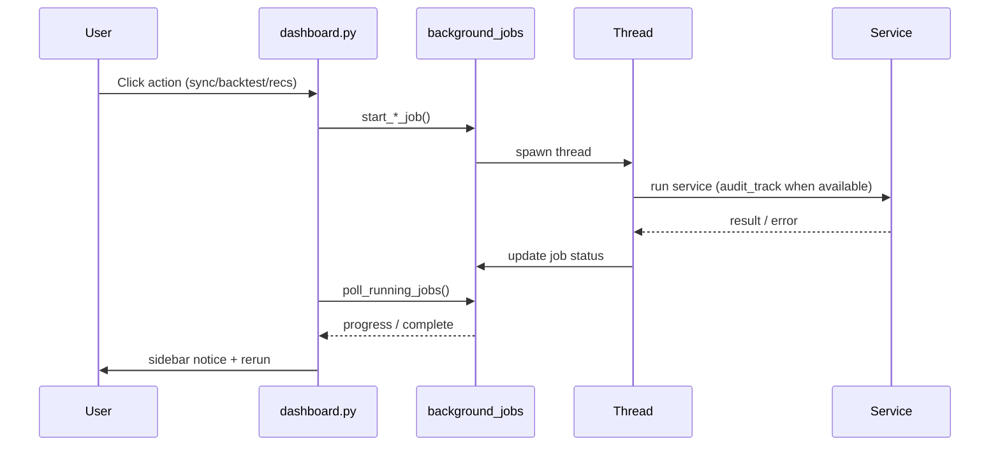

# Streamlit UI

Primary user interface served at **http://localhost:8501**.

## Entry point

| File | Role |
|------|------|
| `backend/ui/dashboard.py` | Main app — sidebar nav, page routing, bootstrap |
| `scripts/run_app.py` | Startup health checks + launches Streamlit |

```bash
python scripts/run_app.py
# equivalent:
cd backend && streamlit run ui/dashboard.py
```

## Navigation structure

```mermaid
flowchart TB
    SB[Sidebar]
    SB --> T[Trading]
    SB --> PB[Pattern backtest]
    SB --> R[Recommendations]
    SB --> MD[Mid day recommendation analysis]
    SB --> EOD[Analysis and EOD]
    SB --> PT[Paper trading trend]
    SB --> PD[Pattern definitions]

    T --> T1[Portfolio summary]
    T --> T2[Positions / Orders / Trades / NIFTY250 radio views]
    T --> T3[Market data stats optional footer]
    T --> T4[Sidebar symbol + Show chart popup]
    T --> T5[Manual order sidebar]
    T --> T6[Live polling 10s on Positions only]

    PT --> PT1[Sharekhan vs Zerodha after-tax]
    PT --> PT2[Daily P&L trend charts]
    PT --> PT3[Closed trades ledger]
    PT --> PT4[Pattern performance]

    PB --> PB1[Universe selector]
    PB --> PB2[30-day simulation section]
    PB --> PB3[Today validation section]
    PB --> PB4[Pattern leaderboard]

    R --> R1[Budget config]
    R --> R2[Run analysis]
    R --> R3[Stock picks section lazy tier]
    R --> R4[Budget and orders section]
    R --> R5[Budget simulation section]

    MD --> MD1[Base budget metrics read-only]
    MD --> MD2[Run mid-day analysis job]
    MD --> MD3[Analysis section comparison]
    MD --> MD4[Place orders section lazy]

    EOD --> EOD1[Trade date selector]
    EOD --> EOD2[Refresh EOD analysis manual load]
    EOD --> EOD3[Metrics and breakdown]

    PD --> PD1[Pattern catalog]
    PD --> PD2[Example charts]
```



## Pages

### 1. Trading

**Function:** `render_trading_page()` in `dashboard.py`

| Section | Content |
|---------|---------|
| Portfolio summary | Budget, invested, cash, equity, unrealized P&L, gross realized P&L (after-tax broker comparison is on **Paper trading trend**) |
| Data views | Horizontal **radio**: **Positions**, **Orders**, **Trades**, **NIFTY250** — only the selected view runs DB work (replaces `st.tabs`, which executed all bodies every rerun) |
| Footer | **Summary only** (default) or **Market data & simulation** — stats block and stale-picks warning load only when the footer section is selected |
| Market data | Last sync, candle range, simulation date, **cached top-3 patterns** (no live recompute on load) |
| Positions | Sortable table; **Chart** opens **intraday popup**; **Reconcile brackets** manual catch-up; live poll every 10s when this view is active |
| Orders | **Current IST session date only**; duplicate bracket cleanup runs only when Orders view is selected; **Current price** (live when polling) |
| Trades | **Current IST session date only** — loaded only when Trades view is selected |
| NIFTY250 view | Constituent table with **Recommended**, **Profitable day** columns; loads market summary + recommendation cache on demand |
| Sidebar | Symbol count caption, **Symbol** dropdown, **Days** slider, **Show chart** (historical OHLC popup), **Place order** (bracket-symbol guard only when **Side = SELL**), **Refresh market data** |

**Performance / lazy loading:**

- `_load_trading_page_data(include_summary=False, include_md_stats=False)` on initial load — portfolio + positions only
- No **NIFTY250 composite snapshot** block (removed)
- No automatic bracket reconcile on page load (manual **Reconcile brackets** only)

**Bracket catch-up (manual only):**

On **Trading** tab load, bracket reconcile does **not** run automatically. Use Positions view → **Reconcile brackets** to call `_reconcile_brackets_if_needed(force=True)` → `TradePlanService.reconcile_session_brackets_after_downtime()`. Timestamp persisted in `backend/app/data/bracket_reconcile_state.json`.

**Live polling:**

- Toggle: **Live polling (10s)** (Positions tab)
- Buttons: **Fetch live prices** (one-shot), **Reconcile brackets** (manual catch-up)
- Implementation: `@st.fragment(run_every=timedelta(seconds=10))` renders from cache; **background thread** fetches NSE quotes and bracket processing via `ui/live_quote_poller.py` (no blocking fetch, no full-page rerun for quotes)
- Only during NSE market hours
- Fetches NSE LTP + day open / prev close / session high → updates bracket plans → **3:25 PM square-off** (bracket + remaining manual positions) → refreshes position display
- Cache shape: `position_live_quotes[symbol] = {ltp, open, prev_close, high}` (legacy float LTP still accepted)
- Does **not** trigger full page rerun for quote updates (Positions fragment only)

### Chart dialogs (Trading tab)

Both use `@st.dialog` with `on_dismiss` handlers so closing the modal (X, backdrop, or **Close**) clears session state — the dialog does **not** reopen on unrelated live-poll reruns.

| Dialog | Trigger | Module |
|--------|---------|--------|
| **Symbol chart** | Sidebar **Show chart** | `ui/symbol_history_chart.py` — daily OHLC candlesticks; **Days** slider inside popup; data cached per symbol/days |
| **Position intraday chart** | Positions tab **Chart** button | `ui/position_intraday_chart.py` — session bars, pattern target/stop markers, **Candle interval** (5m–1h resample) |

### Portfolio total value

**Sharekhan vs Zerodha after-tax comparison** lives on **Paper trading trend** (`_render_paper_trading_after_tax_section()`), not on the Trading tab portfolio summary.

| Metric | Formula |
|--------|---------|
| **Realized P&L after tax** | Gross realized P&L minus STT, stamp duty, brokerage, NSE txn, SEBI, GST, STCG, and DP debit on sell |
| **Total value (at cost)** | `invested + cash available + after-tax realized P&L` |
| **Total value (with unrealized)** | At-cost total **+ unrealized P&L** on open positions |

**Sharekhan profile:** 0.30% per-side brokerage (min ₹0.01/share), no DP charge via broker.  
**Zerodha profile:** Zero delivery brokerage; **₹15.34 DP debit per scrip on sell**.

Computed by `summarize_sell_trades_dual_broker()` in `trade_tax.py` via `_realized_pnl_after_tax_summary()` in `ui/helpers.py`.

### Positions table color legend

| Column | Color meaning |
|--------|----------------|
| **Current price** | Green = nearer **target** within stop–target bracket; red = nearer **stop** (not profit/loss) |
| **Unrealized P&L** | Green = profit vs avg cost; red = loss |
| **To target** | Green = in profit and distance to target; red when unrealized P&L is negative |

### 2. Pattern backtest

**Function:** `render_backtest_page()`

| Feature | Description |
|---------|-------------|
| Universe | NIFTY250 (configurable) |
| Section radio | **Today's validation** \| **30-day simulation** — only active section loads data |
| 30-day simulation | Cached daily snapshot or hard refresh (cache read only when simulation section selected) |
| Today's validation | Validation scorecard for latest day |
| Leaderboard | Pattern rankings with drill-down |
| Background job | Long runs via `SIM_BACKTEST` job |

### 3. Recommendations

**Function:** `render_recommendations_page()`

| Feature | Description |
|---------|-------------|
| Budget | Daily trading budget (INR) |
| Run analysis | Triggers `RECOMMENDATIONS` background job |
| Auto-load | Cached snapshot from DB on tab visit |
| Section radio | **Stock picks** \| **Budget & orders** \| **Budget simulation** — only active section runs heavy work |
| Stock picks | Top patterns + **one tier/bucket at a time** via tier radio (not all six tables) |
| Budget & orders | Allocation metrics, **Place trade** / **Place order for all**; `_load_allocation_trade_plan_state()` runs only in this section |
| Actions | Already-placed lines show disabled **Order placed** + plan status; invalid brackets show disabled **Invalid bracket** |
| Budget simulation | Read-only what-if — alternate budgets, share counts, comparison table; uses separate `rec_sim_budget` session key |
| Tab switch timing | Sidebar navigation audited as `ui.tab_switch` (with `from_page`, `body_ms`, `total_ms`); every page render as `ui.page_render` |
| Session restore | NIFTY250 Trading view + market-data footer call `_ensure_recommendation_session_state()`; stale prior-day session shows a warning |

### 4. Mid day recommendation analysis

**Function:** `render_midday_recommendations_page()` in `dashboard.py`

**Availability:** Trading days **11:45 AM–4:30 PM IST** for **Run mid-day analysis** (`is_midday_analysis_ready()`). Saved results for **today** remain viewable outside that window (read-only).

| Feature | Description |
|---------|-------------|
| Prerequisite | Morning analysis on **Recommendations** tab (DB snapshot) |
| Budget | **Read-only** — no manual budget input. **Available for mid-day** = morning budget − open position cost − \|today's realized P&L\| (profits not reinvested). Computed by `_midday_budget_context()` / `compute_base_budget_available()` |
| Model target max | Editable % cap (same as morning run) |
| Run analysis | Background `MIDDAY_RECOMMENDATIONS` job: session OHLC sync (~250 symbols) → rerun engine → allocate against **available** base budget |
| Daily cache | File `backend/app/data/midday_recommendation_snapshot.json` (gitignored). Auto-load on tab visit via `_ensure_midday_session_state()`; caption shows last-run timestamp |
| Comparison table | Mid-day vs morning buy/target/stop deltas (Analysis section) |
| Section radio | **Analysis** \| **Place orders** — place-order DB work only in Place orders section |
| Budget allocation | Metrics in Analysis section; place-order table in Place orders section |
| Place order | Per-line **Place order** + **Place order for all**; `_load_midday_place_state()` detects applied calibrations (same **Order placed** UX as Recommendations) |
| Calibrations | **Pending entry** → new limit + target/stop; **Open** → target/stop only; **New** → full bracket. Nothing changes until click (`apply_midday_recommendation`) |

**Display module:** `ui/midday_recommendations_display.py`  
**Orchestration:** `ui/recommendation_helpers.py` → `run_midday_recommendation_analysis()`  
**Session OHLC:** `app/services/midday_market_sync.py` → `upsert_intraday_session_candles()`

**Background job progress:** OHLC sync reports `(index, total, message)` — sidebar fragment updates every ~1s while jobs run (`run_background_job_watcher` renders job status inside the fragment).

**Audit:** `recommendation.midday_run`, `recommendation.midday_place`, `job.midday_recommendations`, page slug `midday_recommendations`.

### 5. Analysis & EOD

**Function:** `render_eod_analysis_page()`

| Feature | Description |
|---------|-------------|
| Date picker | Select trade date for analysis |
| Load | **Refresh EOD analysis** only — report is not auto-built on first visit |
| Metrics | Win rate, target hits, stop hits, avg P&L |
| Breakdown | Per-trade detail table |
| Missed targets | Stocks that did not reach target |
| NIFTY250 missed movers | **NIFTY250 — profitable closes not recommended** (after 3:45 PM IST on trade date) |
| Alternatives | Other patterns that would have worked |
| Insights | Reasoning engine suggestions for tomorrow |

The **NIFTY250 — profitable closes not recommended** section mirrors the orange rows on Trading → NIFTY250: stocks that finished up but were not in recommendation picks. Available after `NSE_MISSED_PROFITABLE_CUTOFF` (3:45 PM IST) via `is_missed_profitable_analysis_ready()`.

### 6. Paper trading trend

**Function:** `render_paper_trading_trend_page()`

| Feature | Description |
|---------|-------------|
| **After-tax comparison** | Sharekhan vs Zerodha delivery models — total value at cost and with unrealized P&L (always shown) |
| Trend charts | Auto-load on first tab visit; **Refresh trend** reloads from DB |
| Portfolio summary | Cash, equity, total return, open positions |
| Daily trend | Per-day closed P&L, win rate, cumulative curve (Plotly) |
| **Daily results** table | Sortable by **Date** using typed `DateColumn` (chronological, not string sort); P&L columns as numbers |
| Closed trades | Ledger with source (Rec/Manual), pattern, exit status — **last 30 days** |
| Pattern breakdown | Win rate and P&L by pattern name (same window) |

**Service:** `PaperTradingTrendService` — rolling window matches `PAPER_TRADING_RETENTION_DAYS` (default 30).

**Display module:** `paper_trading_trend_display.py`

### 7. Pattern definitions

**Function:** `render_pattern_definitions_page()` in `pattern_definitions_display.py`

Catalog of all registered patterns with descriptions and synthetic example charts.

---

## UI module map

| Module | Purpose |
|--------|---------|
| `dashboard.py` | Main entry, page renderers, live polling fragment |
| `helpers.py` | Service call wrappers (orders, sync, backtest, EOD, bracket context, duplicate cleanup) |
| `async_runner.py` | Async-to-sync bridge |
| `background_jobs.py` | Threaded long-running tasks |
| `job_api.py` | Job status in sidebar |
| `recommendations_display.py` | DataFrames for recommendation tables |
| `midday_recommendations_display.py` | Mid-day comparison DataFrame |
| `recommendation_helpers.py` | Analysis orchestration (morning + mid-day) |
| `recommendation_chart.py` | Plotly pattern charts |
| `backtest_display.py` | Validation scorecards, matrices |
| `eod_analysis_display.py` | EOD table formatters, missed profitable NIFTY250 DataFrame |
| `paper_trading_trend_display.py` | Paper trading trend charts/tables; `daily_trend_column_config()` for typed Date/P&L columns |
| `positions_display.py` | Positions table rows, open/high formatters, bracket proximity colors |
| `position_intraday_chart.py` | Intraday position chart **dialog** (pattern markers, interval resample) |
| `symbol_history_chart.py` | Historical OHLC **dialog** from sidebar **Show chart** |
| `live_quote_poller.py` | Background NSE prefetch cache (10s interval); records `last_live_poll_at` |
| `tab_switch_audit.py` | Sidebar tab switch + page render timing audit |
| `pattern_definitions_display.py` | Pattern catalog page |
| `pattern_definition_chart.py` | Example candle charts |
| `streamlit_imports.py` | Hot-reload / stale import fixes |

---

## Background jobs



| Job | Trigger | Duration | Progress detail |
|-----|---------|----------|-----------------|
| Market sync | Refresh market data | 30s–2min | Phase messages (sync, backfill) |
| Sim backtest | Hard refresh | 1–5min | Per-pattern load + simulation phases |
| Today prediction | Run prediction | 30s–1min | Standard job messages |
| Recommendations | Run analysis | 1–3min | Ranking, tier/bucket picks, allocation phases |
| Mid-day recommendations | Run mid-day analysis | 5–8min | Session OHLC per symbol (NSE rate limits), then engine + allocation |

Long-running jobs report **detailed progress messages** (pattern phases, `Session OHLC · SYMBOL (n/250)`) via `progress_callback` in `background_jobs.py`. The sidebar **Background tasks** fragment (`run_background_job_watcher`) refreshes progress every ~1s while a job runs.

Only one background job runs at a time (others disabled while running).

Failed jobs record `FAILED` in audit logs (via `audit_track`); jobs are never retried on failure. If audit modules cannot import, the job still runs but without audit wrapping.

---

## Session state keys (selected)

| Key | Purpose |
|-----|---------|
| `nav_page` | Current sidebar page |
| `trading_data_tab` | Trading data view: Positions / Orders / Trades / NIFTY250 |
| `trading_footer_section` | Trading footer: Summary only / Market data & simulation |
| `rec_page_section` | Recommendations: Stock picks / Budget & orders / Budget simulation |
| `rec_tier_view` | Selected cap tier or price bucket in Stock picks section |
| `midday_page_section` | Mid-day: Analysis / Place orders |
| `backtest_page_section` | Backtest: Today's validation / 30-day simulation |
| `live_polling_enabled` | Live quote toggle |
| `last_job_notice` | Success message after job |
| `rec_report` / `rec_allocation` | Cached recommendation session (auto-loaded on Trading tab) |
| `midday_report` / `midday_allocation` | Mid-day analysis session (auto-loaded from daily JSON cache) |
| `midday_from_cache` / `midday_cached_at` | Mid-day results loaded from file vs fresh run |
| `rec_stale_session` | True when displayed picks are from a prior trade date |
| `position_live_quotes` | Live quote cache `{ltp, open, prev_close, high}` per symbol (10s poll) |
| `_pos_chart_dialog_open` / `_symbol_history_dialog_open` | Modal chart dialogs open (cleared on dismiss) |
| `_trading_positions` | Positions list for Trading tab render |

---

## Bootstrap on first load

`_init_app()` in `dashboard.py`:

1. Check PostgreSQL connectivity
2. Run Alembic migrations if needed
3. Seed instruments + paper account
4. Backfill candles if database empty

If Postgres is offline, UI shows warning; limited pages still load.

---

## Hot reload / import fixes

Streamlit caches Python modules aggressively. `streamlit_imports.py` provides:

- `_purge_app_models()` — clear SQLAlchemy `metadata` **and** `registry.dispose()`; purge `app.models`, `app.models.base`, and `app.models.audit_log`
- `ensure_models_fresh()` — reimport models after code changes; verify required exports (`PaperOrder`, `PaperTradePlan`, etc.) and **mapper health** (`Instrument` ↔ `PaperOrder` relationships)
- `ensure_defaults_fresh()` — reimport `app.defaults` (GST rate, DP charges, brokerage constants)
- `ensure_budget_portfolio_fresh()` — reimport `portfolio_total_at_cost`, `portfolio_total_with_unrealized`
- `ensure_trade_tax_fresh()` — purge and reimport dual-broker tax exports (`DualBrokerRealizedPnlSummary`, `summarize_sell_trades_dual_broker`)
- `ensure_applicable_rates_fresh()` — reimport statutory rate helpers after deploy
- `ensure_live_quotes_fresh()` — purge/reimport `app.providers` + `live_quotes` (validates `QuoteData.day_open`, `merge_poll_extremes`)
- `ensure_recommendation_cache_fresh()` — verify `load_cached_recommendations(prediction_date=…)` signature
- `ensure_fresh_ui_modules()` — called on each dashboard load; runs all of the above plus `_force_reimport(budget_allocator)`, job API, market stats, and chart helpers

`app/models/__init__.py` calls `configure_mappers()` after all ORM classes load so forward references resolve cleanly.

Settings access in the UI uses **`getattr(settings, "<field>", DEFAULT_…)`** from `app.defaults` so a stale cached `Settings` object after hot reload does not crash pages (e.g. `daily_trading_budget_inr`, `default_simulation_universe`).

This prevents errors like `Table 'instruments' already defined`, missing model classes, **`PaperOrder failed to locate a name`** mapper failures, **`cannot import portfolio_total_at_cost`**, and **`'RealizedPnlAfterTaxSummary' has no attribute sharekhan`** after long Streamlit sessions or hot reloads.

**If errors persist after a code deploy:** restart Streamlit (`python scripts/run_app.py`). Session refresh key `_ui_modules_fresh_v4` bumps when module contracts change.

---

## Customization tips

| Change | Where |
|--------|-------|
| Add a page | New render function + sidebar entry in `dashboard.py` |
| Change chart style | `recommendation_chart.py`, Plotly config in `dashboard.py` |
| Adjust polling interval | `LIVE_POLL_INTERVAL_SEC` in `ui/live_quote_poller.py` (default 10s) |
| Change default budget | `DAILY_TRADING_BUDGET_INR` in `.env` |
| Lazy-load pattern | Horizontal `st.radio` + conditional branches — not `st.tabs` or collapsed `st.expander` alone |

---

## Lazy loading pattern

Streamlit **`st.tabs`** and collapsed **`st.expander`** still execute all child code every rerun. Heavy pages use **section radios** so only the selected branch runs DB/API work:

| Page | Session key | Sections |
|------|-------------|----------|
| Trading | `trading_data_tab` | Positions / Orders / Trades / NIFTY250 |
| Trading | `trading_footer_section` | Summary only / Market data & simulation |
| Recommendations | `rec_page_section` | Stock picks / Budget & orders / Budget simulation |
| Recommendations | `rec_tier_view` | One cap tier or price bucket at a time |
| Mid-day | `midday_page_section` | Analysis / Place orders |
| Pattern backtest | `backtest_page_section` | Today's validation / 30-day simulation |

**Helpers:** `_load_trading_page_data(include_summary=False, include_md_stats=False)` defers market summary and stats until needed.

Next: [Configuration](09-configuration.md)
