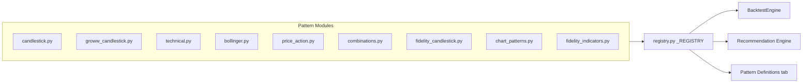
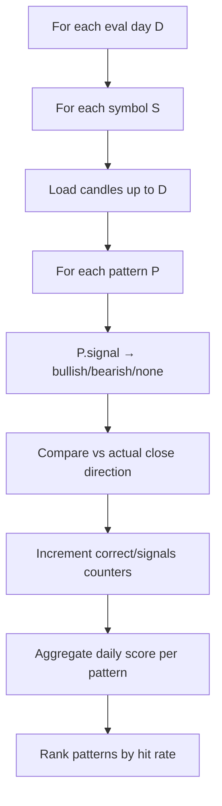
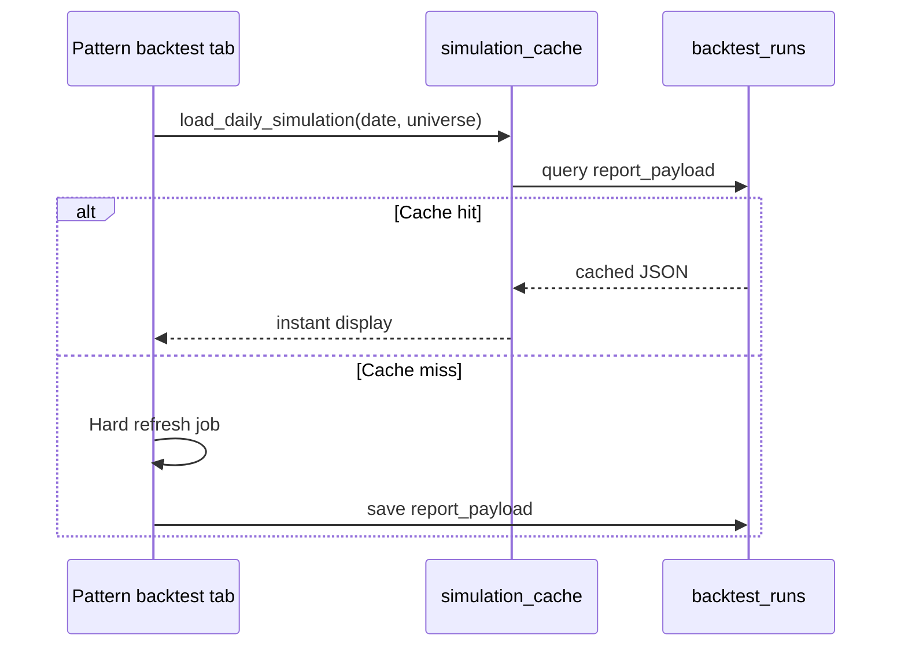

# Patterns & Backtesting

Technical pattern registry, evaluation logic, and simulation caching.

## Pattern registry

Patterns are auto-registered via the `@register_pattern` decorator at import time.



**Registry API** (`backend/app/strategies/registry.py`):

| Function | Returns |
|----------|---------|
| `get_all_patterns()` | All registered `Pattern` instances |
| `get_pattern(id)` | Single pattern by ID |

**Base class:** `backend/app/strategies/base.py` — defines `Pattern` interface with `id`, `name`, `signal(candles)` method.

---

## Pattern categories

| Module | Examples | Count (approx) |
|--------|----------|----------------|
| `candlestick.py` | Doji, Hammer, Engulfing | 3+ |
| `groww_candlestick.py` | Extended candlestick set | 35+ |
| `technical.py` | SMA cross, RSI, MACD | 3+ |
| `bollinger.py` | Mean reversion, breakout, squeeze | 3 |
| `price_action.py` | Swing structure, volume breakout | 3 |
| `combinations.py` | Multi-indicator combos | 5 |
| `fidelity_candlestick.py` | Fidelity-style candlestick patterns | 12+ |
| `chart_patterns.py` | Double top/bottom, triangles, flags | 8+ |
| `fidelity_indicators.py` | ADX, ATR, OBV, CMF, Stochastic, StochRSI | 7+ |

**Total:** 79 registered patterns (metadata in `pattern_definitions.json`)

**Indicators:** Shared helpers in `backend/app/strategies/indicators.py` (ADX, ATR, OBV, CMF, Stochastic, StochRSI) used by Fidelity-style patterns.

---

## Backtest evaluation

### Inputs

| Parameter | Default | Description |
|-----------|---------|-------------|
| `eval_days` | 30 | Trading days to evaluate |
| `lookback_days` | 20 | Candle history for pattern signal |
| `universe` | NIFTY250 | Symbol set |
| `simulation_date` | Last trading day | As-of date |

### Algorithm



### Scoring

- **Daily score:** Count of symbols where pattern prediction matched actual direction (e.g. 12/15)
- **Hit rate:** `total_correct / total_signals` over eval window
- **Rank:** Patterns sorted by overall performance

### Validation rule

Pattern uses `lookback_days` of history ending on day D-1. Actual outcome = close(D) vs close(D-1) direction.

---

## Persistence

Results stored in three tables:

| Table | Content |
|-------|---------|
| `backtest_runs` | Run metadata + optional JSON cache |
| `backtest_pattern_scores` | Per-pattern aggregates |
| `backtest_stock_scores` | Per-pattern per-symbol breakdown |

---

## Daily simulation cache

To avoid re-running expensive backtests on every page load:



**Unique key:** `(simulation_date, universe)` via migration 003

**Service:** `backend/app/services/simulation_cache.py`

**Payload contract:** `serialize_report()` reads `BacktestReport.patterns` (list of `PatternResult`). The JSON key is `"patterns"` — not `pattern_results`. `deserialize_report()` rebuilds the dataclass for UI display and API routes.

---

## Today's prediction

Latest-day signal matrix:

- For each pattern, show bullish/bearish/neutral for each symbol
- Validation scorecard compares predictions vs actual (when day completes)
- Displayed on Pattern backtest tab via `backtest_display.py`

---

## Adding a new pattern

1. Create or edit a file under `backend/app/strategies/patterns/`
2. Subclass `Pattern` from `app.strategies.base`
3. Decorate with `@register_pattern`
4. Implement `id`, `name`, and `signal()` method
5. Restart Streamlit — pattern appears automatically

**Example skeleton:**

```python
from app.strategies.base import Pattern, Signal
from app.strategies.registry import register_pattern

@register_pattern
class MyPattern(Pattern):
    id = "my_pattern"
    name = "My Custom Pattern"

    def signal(self, candles) -> Signal:
        # Return Signal.BULLISH, Signal.BEARISH, or Signal.NONE
        ...
```

No changes to `BacktestEngine` required.

---

## Backtest UI workflow

| Action | Behavior |
|--------|----------|
| Open tab | Load cached simulation if available |
| Hard refresh | Background `SIM_BACKTEST` job → full re-run with per-pattern progress messages |
| Run in progress | Inline progress bar shows current pattern / simulation phase |
| Select pattern | Drill-down to per-stock daily matrix |
| Universe dropdown | Switch NIFTY250 / other configured universe |

---

## API access

| Endpoint | Purpose |
|----------|---------|
| `GET /api/backtest/patterns` | List patterns |
| `POST /api/backtest/run` | Trigger run |
| `GET /api/backtest/latest` | Leaderboard |
| `GET /api/backtest/{run_id}/patterns/{id}/detail` | Drill-down |

See [API reference](07-api-reference.md).

Next: [Paper trading & brackets](11-paper-trading-and-brackets.md)
