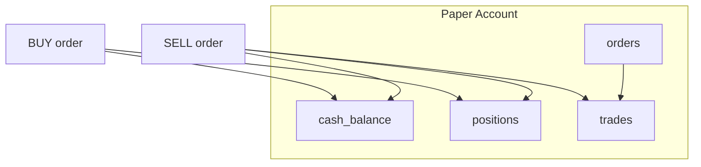
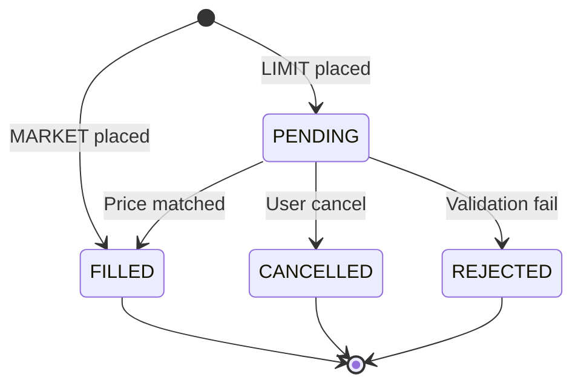
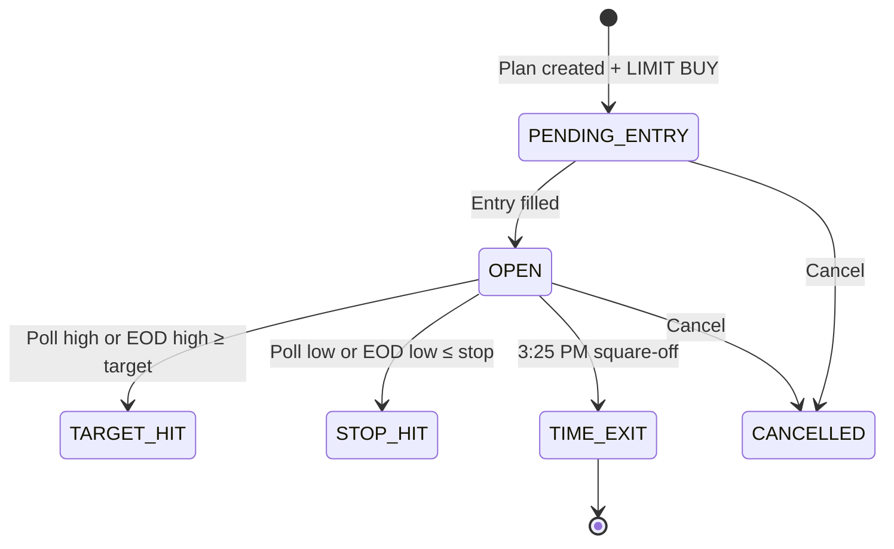
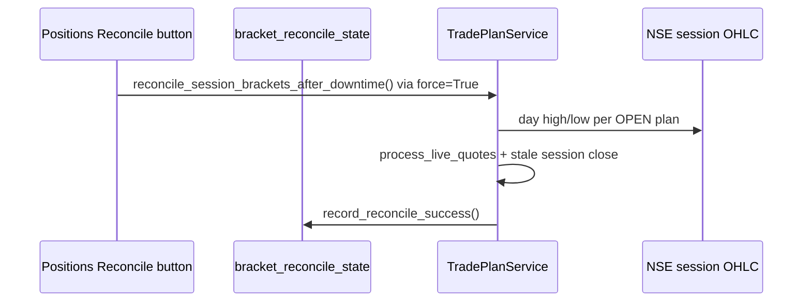

# Paper Trading & Bracket Orders

Virtual trading engine, order types, and automated bracket trade plans.

## Paper trading overview



**Service:** `PaperTradingService` in `backend/app/services/paper_trading.py`

**Default account:** Created at bootstrap with `PAPER_STARTING_CASH`

---

## Order types

| Type | Behavior | Fill price |
|------|----------|------------|
| **MARKET** | Immediate fill | Latest close or provided LTP |
| **LIMIT** | Stays PENDING until price crosses limit | Limit price when matched |

### Order statuses



---

## Position & P&L rules

| Metric | Formula |
|--------|---------|
| **Avg cost** | Weighted average on BUY fills |
| **Unrealized P&L** | `(current_price - avg_cost) × quantity` — `current_price` is live LTP when polling, else last EOD mark |
| **Realized P&L** | `(sell_price - avg_cost) × quantity` on SELL |
| **Cash** | Reduced on BUY, increased on SELL |

**Sell rejection:** Cannot sell more shares than held.

**Budget enforcement:** BUY orders checked against `DAILY_TRADING_BUDGET_INR` via `budget_portfolio.py`.

---

## Position source (Manual vs Recommendation)

Positions are classified at read time (not stored in `paper_positions`):

| Source | How created | UI badge |
|--------|-------------|----------|
| **Recommendation** | Recommendations tab → **Place trade** / **Place order for all** (creates `PaperTradePlan`) | Blue **Rec** |
| **Manual** | Trading tab sidebar → **Place order** (no active plan) | Orange **Manual** |

Classification rule: symbol has an active plan in `PENDING_ENTRY` or `OPEN` → **Recommendation**; otherwise **Manual**.

The Positions tab shows a **Source** column with color-coded badges (`_position_source_badge` in `dashboard.py`).

---

## Manual trading (UI)

**Location:** Trading tab → sidebar order form

| Field | Options |
|-------|---------|
| Symbol | Dropdown of active instruments |
| Side | BUY / SELL |
| Type | MARKET / LIMIT |
| Quantity | Integer shares |
| Limit price | Required for LIMIT |

---

## Bracket trade plans

Bracket plans automate: **limit entry → target exit → stop exit**.

### Creation

From **Recommendations** tab:

1. Run analysis → get stock picks with entry/target/stop
2. Click **Place trade** (single) or **Place order for all** (batch)
3. Creates `PaperTradePlan` + pending LIMIT BUY order

**Service:** `TradePlanService.place_recommendation_plan()`

### Mid-day calibrations

From **Mid day recommendation analysis** tab (after morning snapshot exists):

| Plan status | **Place order** behavior |
|-------------|-------------------------|
| None / cancelled | New bracket via `place_recommendation_plan()` |
| `PENDING_ENTRY` | Cancel old limit, place new limit + target/stop (`_calibrate_pending_plan`) |
| `OPEN` | Update target/stop only (`_calibrate_open_plan`) |
| Closed (target/stop/time) | Button disabled — no changes |

**Service:** `TradePlanService.apply_midday_recommendation()`

**Budget validation:** Uses `compute_base_budget_available()` when `session_realized_pnl` is passed — deployable cash from morning base budget only (profits not reinvested).

### Plan fields

| Field | Description |
|-------|-------------|
| `entry_limit_price` | Limit buy price |
| `target_price` | Take-profit level |
| `stop_loss_price` | Stop-loss level |
| `shares` | Quantity |
| `pattern_name` | Source pattern (optional) |
| `recommendation_date` | Day plan was created |

**Constraint:** One plan per `(account, symbol, recommendation_date)` in the database.

**Session duplicate guard:** `TradePlanService._find_active_session_plan()` blocks a second plan for the same symbol when an active plan already exists for the current recommendation/market session **or** when an entry order for that symbol was placed **today** (IST). This prevents double placement when `recommendation_date` differs between runs (e.g. prior-day EOD picks vs today's session).

---

## Bracket lifecycle



### Entry fill conditions

| Mode | Condition |
|------|-----------|
| **Live (intraday)** | Observed poll low (min LTP across 10s polls since session start) ≤ `entry_limit_price` |
| **EOD** | Day's low ≤ `entry_limit_price` |

### Exit fill conditions

| Exit | Live | EOD |
|------|------|-----|
| **Target** | Observed poll high (max LTP across 10s polls) ≥ target — fill at target price | Day's high ≥ target |
| **Stop** | Observed poll low ≤ stop (stop must be below entry) — fill at stop price | Day's low ≤ stop |
| **3:25 PM square-off** | LTP at/after 15:25 IST | Day's close (fallback if still open) |

**Invalid bracket levels:** `bracket_utils.is_valid_bracket_levels(buy, target, stop)` requires `stop < buy < target`. `place_recommendation_plan()` rejects invalid levels. The budget allocator skips invalid primaries and backfills same-tier alternates. Live exits also require valid levels before firing.

Open positions that have not hit target or stop by **3:25 PM IST** are automatically sold during live polling:

1. **Bracket plans** — `TradePlanService.process_live_quotes()` exits open plans at LTP (`TIME_EXIT` status).
2. **Manual holdings only** — `PaperTradingService.square_off_remaining_positions()` market-sells positions **not** tied to an open bracket plan.

EOD fallback: `process_eod()` squares off open bracket plans at the day's close, then `square_off_remaining_at_close()` closes manual holdings only.

Status for bracket exits: `TIME_EXIT`.

---

## Exit safeguards

Recommendation bracket positions must **not** be closed manually or by stale EOD data. Safeguards:

| Safeguard | Where | Behavior |
|-----------|-------|----------|
| **No manual Sell (Rec)** | Positions tab | **Rec** rows show disabled **Bracket** button instead of Sell |
| **No sidebar SELL** | Trading sidebar + `_place_order()` | SELL rejected when symbol has active `PENDING_ENTRY` or `OPEN` plan; sidebar shows warning |
| **Live stop/target only** | `process_live_quotes()` | Stop/target fire only when stop &lt; entry and target &gt; entry |
| **No stale EOD on today's entries** | `_plan_applies_to_eod_bar()` | EOD bar skipped if entry filled **after** `trade_date` |
| **No mid-session stale EOD** | `ingestion.backfill_candles()` | During live hours, `process_eod(end)` skipped when `end` is a prior session (live polling handles exits) |
| **3:25 square-off scope** | `square_off_remaining_positions()` | Skips symbols with **OPEN** bracket plans (handled by `process_live_quotes`) |
| **EOD manual-only cleanup** | `square_off_remaining_at_close()` | Skips symbols with **OPEN** bracket plans |
| **Live polling warning** | Positions tab | Banner when polling is off during market hours |

**Required for intraday brackets:** Enable **Live polling (10s)** on the Positions tab during 9:15 AM–4:30 PM IST. **Refresh market data** updates OHLCV only; it does not drive bracket exits during the live session.

---

## EOD processing

Runs automatically after market data sync:

```
ingestion.sync_latest() → TradePlanService.process_eod(last_trading_day)
```

Uses daily OHLCV bars — not intraday ticks.

---

## Live processing

During market hours with **Live polling (10s)** enabled:

```
live_quotes.fetch → merge_poll_extremes + nse_day_high/low → TradePlanService.process_live_quotes(quotes)
                 → (if ≥ 3:25 PM IST) PaperTradingService.square_off_remaining_positions(quotes)
```

`SessionQuote.observed_high` / `observed_low` use poll extremes **and** NSE session day high/low so targets/stops are not missed when LTP has moved back.

Updates plans, closes manual holdings, and creates fill orders without full page rerun.

### Bracket catch-up after downtime

Automatic and manual catch-up when live polling was offline or stale:



| Trigger | Entry point |
|---------|-------------|
| **Manual** | Positions view **Reconcile brackets** button → `_reconcile_brackets_if_needed(force=True)` |
| **CLI ops** | `python -m app.jobs.reconcile_session_targets` (NSE OHLC only for OPEN plans) |

`should_auto_reconcile()` remains in `bracket_reconcile_state.py` for tests and CLI helpers but is **not** called on Trading tab load.

Persisted state file: `backend/app/data/bracket_reconcile_state.json` (`last_reconcile_at`, `last_live_poll_at`).

### Reconcile session targets (CLI ops)

If poll-based live exits missed a target/stop touch (e.g. app was offline), run a one-off catch-up:

```bash
cd backend && .venv/bin/python -m app.jobs.reconcile_session_targets
```

Calls `TradePlanService.reconcile_open_plans_with_nse_day_ohlc()` — matches OPEN plans against NSE session OHLC for the active date.

## UI behavior after placing plans

| Element | Behavior |
|---------|----------|
| **Place trade** | Disabled **Order placed** button when an active session plan exists; caption shows plan status (e.g. Pending entry, Open) |
| **Place order for all** | Hidden when all lines have plans; submits **pending symbols only** (skips already-placed) |
| Positions tab | **Summary row**; **Chart** → intraday **popup**; **Reconcile brackets**; sortable table; Rec symbols blue / Manual black; **Rec** rows have no Sell (bracket-managed) |
| Orders tab | Session-scoped list; **Current price** (live NSE `*` when polling), **Target buy**, **Target sell** from bracket plan; **Cancel** for pending; cancelled orders hidden |
| Trades tab | Filtered to **current IST session date** only |

### Duplicate bracket cleanup

Accidental double placement (e.g. **Place trade** then **Place order for all** before session guards existed) may leave duplicate orders in `paper_orders`.

On each **Orders** tab visit, `TradePlanService.cleanup_duplicate_session_plans()` runs automatically:

1. Groups active session plans by symbol.
2. Keeps the **earliest** plan (lowest `entry_order_id`).
3. Cancels duplicate **pending** entry orders and marks duplicate plans `CANCELLED`.
4. **Reverses duplicate filled BUY** entries via `PaperTradingService.undo_filled_buy_entry()` (restores cash, reduces position).
5. **Reconciles stuck OPEN plans** with zero holdings (links to today's SELL trade if found, otherwise marks `CANCELLED`).
6. **Clears failed bracket exit spam** — cancels duplicate `REJECTED` SELL orders from live-polling retry loops.

An info banner summarizes cleanup when anything was removed. Future placement is blocked by `_find_active_session_plan()`.

### Failed exit retry prevention

When live polling hits target/stop/3:25 but the SELL cannot fill (e.g. no shares held):

| Step | Behavior |
|------|----------|
| Before exit | `_held_quantity()` checked; zero holdings → reconcile plan instead of placing SELL |
| After REJECTED | `exit_order_id` recorded; **no further SELL** placed on next poll for same quantity |
| Orders tab load | `_cleanup_rejected_exit_orders()` cancels accumulated `REJECTED` bracket SELL rows |

---

## Linked orders

Each plan may reference:

| FK | Order type |
|----|------------|
| `entry_order_id` | LIMIT BUY (entry) |
| `exit_order_id` | MARKET SELL (target or stop exit) |

Both link to standard `paper_orders` / `paper_trades` records.

---

## Tax & cost modeling

Recommendation profit projections and the Trading tab portfolio summary use `trade_tax.py` with **`broker_delivery_profiles.py`** charge models.

### Sharekhan delivery (default for recommendations)

Aligned with [Sharekhan pricing](https://www.sharekhan.com/pricing):

| Charge | Rate |
|--------|------|
| Brokerage | 0.30% per side (min ₹0.01/share) |
| STT | 0.1% on sell (statutory) |
| Stamp duty | 0.015% on buy |
| NSE transaction | 0.00297% |
| SEBI turnover | ₹10/crore |
| GST | 18% on (brokerage + exchange + SEBI) |
| DP debit | ₹0 (via broker) |
| STCG | 20% on profit before tax |

### Zerodha delivery (comparison on Paper trading trend tab)

Aligned with [Zerodha charges](https://zerodha.com/charges/#tab-equities):

| Charge | Rate |
|--------|------|
| Brokerage | ₹0 (delivery) |
| STT / stamp / STCG | Same statutory rates |
| NSE transaction | 0.00307% |
| DP debit | **₹15.34 per scrip on sell** |

### Portfolio total value

On **Paper trading trend** (Sharekhan vs Zerodha after-tax section):

```
Total value (at cost)     = invested + cash available + after-tax realized P&L
Total value (with unrealized) = at cost + unrealized P&L on open positions
```

The **Trading** tab portfolio summary shows gross realized P&L only; after-tax dual-broker totals are on **Paper trading trend**.

Paper trading fills do not deduct taxes from cash (tax is informational in recommendations and summary tables).

---

## API endpoints

| Method | Path | Action |
|--------|------|--------|
| POST | `/api/paper/orders` | Place manual order |
| DELETE | `/api/paper/orders/{id}` | Cancel pending |
| GET | `/api/paper/positions` | View holdings |
| GET | `/api/paper/trades` | Trade history |

Bracket plans are currently UI-driven (no dedicated REST endpoints).

Next: [Recommendations engine](12-recommendations-engine.md)
