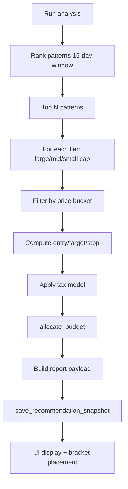
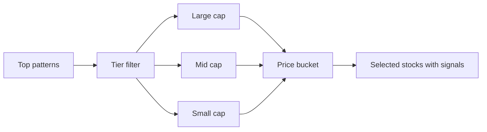
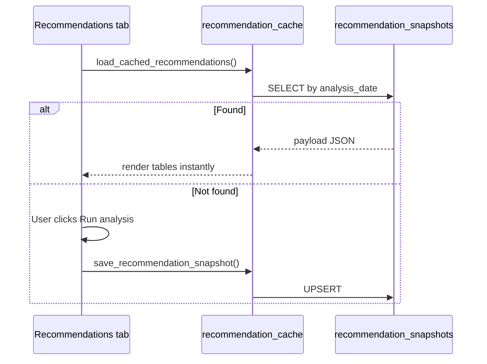
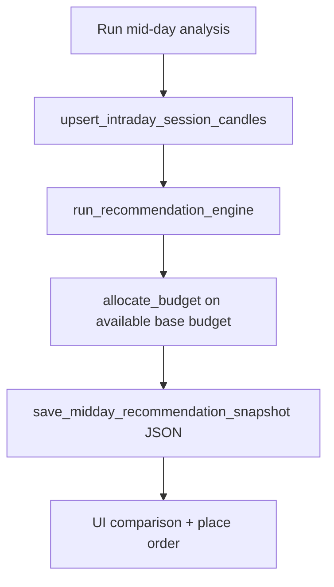

# Recommendations Engine

Daily stock selection, budget allocation, and snapshot caching.

## Overview

The recommendation engine combines **pattern backtest rankings** with **universe tier/bucket filters** to produce actionable trade ideas with entry, target, and stop levels.



**Entry point:** `run_recommendation_engine()` in `backend/app/services/recommendation_engine.py`

**UI orchestration:** `backend/ui/recommendation_helpers.py`

---

## Input parameters

| Parameter | Source | Default |
|-----------|--------|---------|
| Daily budget | `DAILY_TRADING_BUDGET_INR` | ₹50,000 (code) |
| Max target profit | `MAX_TARGET_PROFIT_PCT` | 80% |
| Universe | `MARKET_DATA_UNIVERSE` | NIFTY250 — all pattern scans |
| Cap tier grouping | Latest close | Large ≥ ₹100 · mid ≥ ₹30 · small ≥ ₹10 |
| Pattern window | Engine constant | 15 trading days |
| Min expected move | `recommendation_universe.json` | ₹1 per share (actual sell − buy) |
| Min relative volume | `recommendation_universe.json` | 0.75× 20-day average |
| Volume lookback | `recommendation_universe.json` | 20 sessions |

---

## Selection filters (per stock)

Before a symbol is recommended:

1. **Pattern signal** — at least one qualified bullish pattern must fire.
2. **Minimum expected move** — `actual_sell_price − buy_price ≥ ₹1` (configurable via `min_expected_move_inr`).
3. **Volume liquidity** — latest session volume must be ≥ `min_relative_volume` × the prior N-day average (default 0.75× over 20 days).
4. **Bracket validity** — stop &lt; buy &lt; target after tax-adjusted target projection.

**Volume intelligence:** relative volume feeds into **confidence** (+4 to +15 when volume is above average; −8 when thin). Candidate ranking uses `(confidence, volume_score, expected_move_inr, pattern_hit_rate)`.

---

## Pattern ranking

1. Load recent backtest scores for all patterns
2. Rank by hit rate and consistency over 15-day window
3. Select top patterns for stock picking

Patterns with insufficient signals are deprioritized.

**Ranking boost:** `pattern_ranking_boost_pct` in `recommendation_universe.json` adds tie-break weight (not displayed hit rate) for preferred setups — default: Swing Structure +9, NR4 +7, Piercing Line +6, Bullish Kicker +6, Bullish Separating Lines +6, Engulfing +4; Falling Wedge 0 (live P&L demoted).

**Pattern exclusions:** `pattern_exclude_ids` removes patterns from ranking and stock scans (default: Tweezer Bottom).

**Per-pattern pick cap:** `pattern_max_picks_per_day` limits how many recommendations use the same pattern id (default: RSI Momentum max 2).

**Target tuning:** `target_atr_multiplier` (0.35) and `target_resistance_factor` (0.85) tighten intraday sell targets; `default_max_target_profit_pct` (50%) caps model upside when the UI does not override.

**Net-profit gate:** `reference_allocation_inr` (₹5,500) and `min_net_profit_after_tax_inr` (₹1) — target is **raised** toward the model cap until net profit after charges is positive; a symbol is skipped only if no profitable target fits within the cap.

**Bracket fill:** Each cap tier and price bucket scans **one pattern at a time** (ranked order, then expanded pool) until **3 profitable picks** or no patterns remain. Empty bracket = no stocks in range; short bracket = no profitable setups after full pattern sweep.

**NR4 confluence:** When NR4 (`pa_nr4`) fires alongside at least one other bullish pattern, the pick gets `nr4_confluence_confidence_boost` (+8 default) and is tie-broken ahead of non-confluence picks. Tier scans always union NR4 into the active pattern set when `always_scan_nr4` is true (default), so NR4+alignment setups are considered even before the engine expands past the top-3 patterns.

---

## Stock selection

Two-dimensional filter:



**Scan universe:** All stored **NIFTY250** OHLCV whose symbol is in the **latest constituent list** (refreshed from NSE at the start of each recommendation run; same cache updated by **Refresh market data**). Delisted names, legacy holdings, and non-index stocks are excluded even if OHLCV remains in the database.

**Price buckets:** Configurable ranges (e.g. below ₹100, below ₹500). A stock appears in **at most one** bucket. Cap-tier picks (large/mid/small) are **never repeated** in price buckets. Picks expand to lower-ranked patterns until each section has up to 3 names.

Each selected stock includes:

- Symbol, pattern name, signal direction
- Entry limit price (typically near current close)
- Target price (capped by `MAX_TARGET_PROFIT_PCT`)
- Stop loss price
- Expected move per share (₹) — must be ≥ ₹1
- Relative volume vs 20-day average
- Expected net profit after tax

---

## Budget allocation

**Service:** `budget_allocator.py`

| Step | Description |
|------|-------------|
| Score weighting | Higher-confidence picks get larger share |
| Share rounding | Integer shares based on entry price |
| Budget cap | Total allocation ≤ daily budget |
| Invalid bracket skip | Skips picks where `target ≤ entry`; records symbol in `skipped_invalid` |
| Same-tier backfill | Substitutes alternates from the same cap tier (`backfilled_symbols`) |
| Line output | `AllocationLine` with symbol, shares, INR, target/stop |

**Validation:** `bracket_utils.is_valid_bracket_levels(buy, target, stop)` — shared rule used by allocator and UI place-order guards.

---

## Budget simulation (UI)

Read-only what-if section on the Recommendations page (`_render_budget_simulation_section` in `dashboard.py`):

| Feature | Description |
|---------|-------------|
| Purpose | Test share counts at different budgets without placing orders |
| Session key | `rec_sim_budget` — independent from `rec_budget` used for paper trades |
| Presets | ₹25K, ₹50K, ₹75K, ₹1L, ₹2L quick buttons |
| Output | Metrics, compact share table, full breakdown expander, cross-budget comparison table |
| No trade actions | No **Place trade** or **Place order for all** — does not write to `rec_allocation` |

**Display helpers:** `allocation_simulation_dataframe()`, `budget_simulation_comparison_dataframe()` in `ui/recommendations_display.py`

---

## Snapshot caching



**Table:** `recommendation_snapshots`

| Column | Purpose |
|--------|---------|
| `analysis_date` | UNIQUE — day analysis was run |
| `prediction_date` | Next **NSE trading day** target (see below) |
| `payload` | Full JSON report |

**Prediction date** (`recommendation_prediction_date()` in `market_calendar.py`):

- **Before 4:30 PM IST** on a trading day → target **today’s session** (OHLC through yesterday).
- **After 4:30 PM IST** (or on weekends/holidays) → target the **next trading day** after the latest OHLC.
- Skips **weekends** and **NSE holidays** from `app/data/nse_trading_holidays.json`.

**Data freshness:** `data_through_date` on the report is the **minimum** latest OHLC date across all NIFTY250 symbols scanned. **Refresh market data** syncs the full NIFTY250 universe.

**Benefit:** Recommendations persist across tab switches and app restarts without re-running the engine.

**Mid-day cache (separate):** `save_midday_recommendation_snapshot()` / `load_midday_cached_recommendations_for_ui()` persist to `backend/app/data/midday_recommendation_snapshot.json` (not the DB). Does not overwrite the morning row.

**Trading tab sync:** `_ensure_recommendation_session_state()` auto-loads the active session snapshot (via `load_cached_recommendations(prediction_date=...)`) into Streamlit session state so Trading → NIFTY250 highlights and EOD snippets match today's picks. A warning appears when viewing a prior session's picks after the calendar rolls forward.

---

## Report payload structure (conceptual)

```json
{
  "analysis_date": "2026-07-29",
  "prediction_date": "2026-07-30",
  "budget_inr": 100000,
  "patterns": [...],
  "tier_picks": {
    "large_cap": [...],
    "mid_cap": [...],
    "small_cap": [...]
  },
  "bucket_picks": {...},
  "allocation": [
    {
      "symbol": "TCS",
      "shares": 5,
      "entry_limit_price": 3850.0,
      "target_price": 4200.0,
      "stop_loss_price": 3700.0,
      "pattern_name": "rsi_oversold",
      "amount_inr": 19250.0
    }
  ],
  "generated_at": "..."
}
```

Exact schema is defined by the engine output — treat as versioned JSON.

---

## UI workflow

| Step | User action | System response |
|------|-------------|-----------------|
| 1 | Open Recommendations tab | Auto-load cached snapshot if exists |
| 2 | Adjust budget / target % | Update session inputs |
| 3 | Click **Run analysis** | Background `RECOMMENDATIONS` job with phased progress (ranking → picks → allocation) |
| 4 | Review tables | Tier picks, bucket picks, allocation |
| 5 | **Place trade** / **Place order for all** | Create bracket plans for pending lines with valid brackets only; placed lines show **Order placed** |
| 6 | Budget simulation (optional) | Try alternate budgets — share counts only, no orders |

### Detecting already-placed allocation lines

`ui/helpers.py` → `_load_allocation_trade_plan_state(recommendation_date, line_symbols)`:

- Loads trade plans inside an active DB session (avoids detached ORM symbols).
- Matches a line as placed when the plan's `recommendation_date` equals the report date **or** `active_market_session_date()`, **or** the linked entry order was created on `current_session_date()` (IST).
- Returns `(placed_symbols, status_map)` for the allocation table and **Place order for all** filter.

---

## Background job

Job type: `RECOMMENDATIONS` in `background_jobs.py`

- Runs in background thread
- Progress shown in sidebar **and** inline on the Recommendations page (pattern/phase messages)
- On completion: saves snapshot, shows success notice, reruns page

---

## Integration with bracket trading

Each allocation line maps 1:1 to a `PaperTradePlan`:

```
place_recommendation_plan(symbol, shares, entry, target, stop, pattern_name)
```

See [Paper trading & brackets](11-paper-trading-and-brackets.md).

---

## Mid-day recommendation analysis

After **11:45 AM IST**, rerun the engine on **partial session OHLC** and compare picks against the morning snapshot.



| Aspect | Detail |
|--------|--------|
| **When** | Run button: trading days 11:45 AM–4:30 PM IST. View saved results anytime same day |
| **Morning prerequisite** | DB snapshot from Recommendations tab (`load_cached_recommendations_for_ui`) |
| **Budget for allocation** | **Available base budget** — not editable. `morning_budget − invested_open − \|realized_P&L_today\|` via `compute_base_budget_available()` |
| **Morning budget source** | Budget from today's morning snapshot (`rec_budget` / cached DB row) or settings default |
| **Session OHLC** | `midday_market_sync.upsert_intraday_session_candles()` — NIFTY250 symbols, ~5 min (NSE rate limits) |
| **Morning snapshot** | **Not overwritten** — mid-day cache is separate JSON file |
| **Daily cache file** | `backend/app/data/midday_recommendation_snapshot.json` (gitignored) |
| **Auto-load** | `_ensure_midday_session_state()` on tab open; caption: *Loaded from today's saved mid-day analysis (timestamp)* |
| **Place order** | `apply_midday_recommendation()` — new / pending calibrate / open calibrate; validates with `session_realized_pnl` |
| **Place-order UX** | `_load_midday_place_state()` + `is_midday_action_applied()` — disabled **Order placed** when calibration/placement already done (matches Recommendations tab) |

**Comparison service:** `midday_recommendations.build_midday_comparison_rows()` — action kinds: `NEW`, `PENDING_CALIBRATE`, `OPEN_CALIBRATE`.

**Background job:** `MIDDAY_RECOMMENDATIONS` in `background_jobs.py`.

**Audit actions:** `recommendation.midday_run`, `recommendation.midday_place`, `job.midday_recommendations`.

---

## Tax-adjusted profit

Before ranking picks, expected profit is net of Indian equity delivery charges (Sharekhan-aligned profile):

- STCG (20%)
- STT (0.1% on sell)
- Stamp duty (0.015% on buy)
- Brokerage (0.30% per side, min ₹0.01/share)
- NSE transaction, SEBI turnover, GST (18%)

**Services:** `trade_tax.py`, `broker_delivery_profiles.py` (`SHAREKHAN_DELIVERY`)

The **Paper trading trend** tab shows a **Zerodha delivery** comparison (zero brokerage, ₹15.34 DP/scrip on sell) for closed paper trades — this does not change recommendation ranking.

This gives realistic profit projections for Indian equity paper trading.

Next: [Audit & observability](13-audit-and-observability.md)
