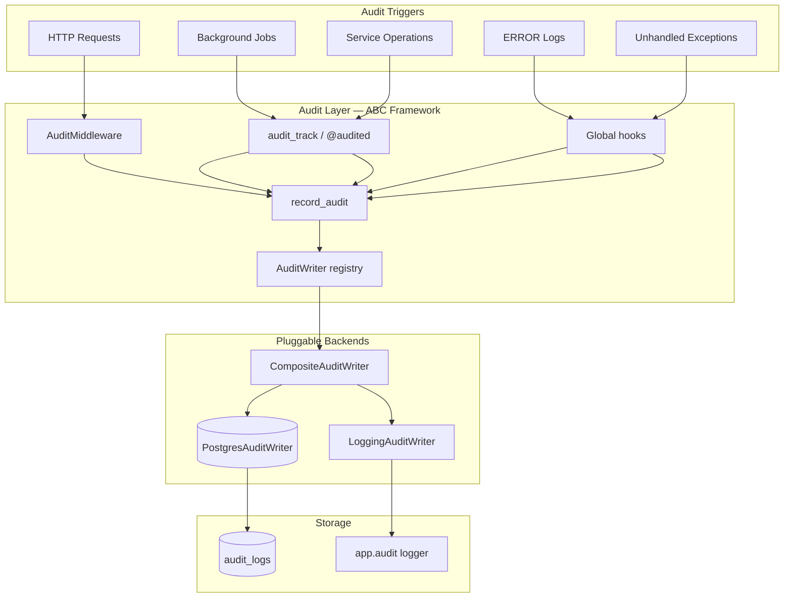
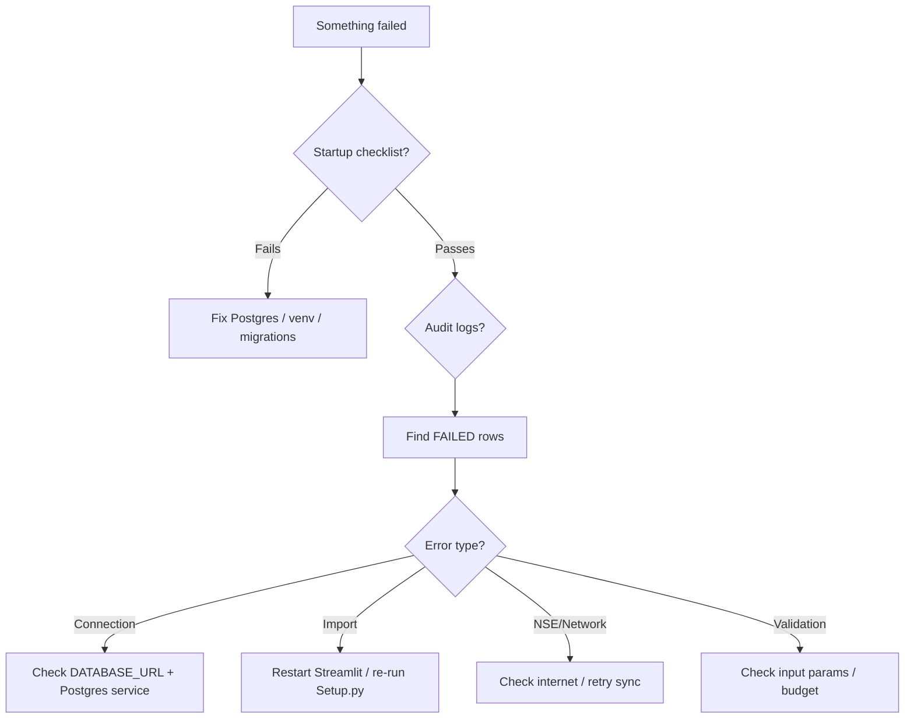

# Audit & Observability

Structured logging, audit trails, and troubleshooting.

## Audit system overview



**Master switch:** `AUDIT_ENABLED=true` in `.env`  
**Default backend:** `AUDIT_BACKEND=composite` (PostgreSQL + stdlib logging)

---

## ABC framework

Audit persistence uses an **Abstract Base Class** pattern so writers are pluggable and testable.

| Type | Module | Role |
|------|--------|------|
| `AuditEvent` | `audit_backends/base.py` | Normalized event dataclass |
| `AuditWriter` (ABC) | `audit_backends/base.py` | `async write(event) -> id \| None` |
| `AuditReader` (ABC) | `audit_backends/base.py` | Query persisted logs |
| `PostgresAuditWriter` | `audit_backends/postgres.py` | Writes to `audit_logs` |
| `LoggingAuditWriter` | `audit_backends/logging_backend.py` | Emits to `app.audit` logger |
| `CompositeAuditWriter` | `audit_backends/composite.py` | Fan-out to multiple writers |
| `NoOpAuditWriter` | `audit_backends/noop.py` | No-op when audit disabled |

**Registry:** `get_audit_writer()` / `build_audit_writer()` in `audit_backends/registry.py`

**Public API (unchanged):** `record_audit`, `audit_track`, `audit_track_sync`, `list_audit_logs` in `audit.py`

**Dispatch:** `schedule_audit_event()` in `audit_dispatch.py` — fire-and-forget by default; business logic never waits for DB writes. When no asyncio loop is running (sync Streamlit context), dispatch uses a background thread or `ui.async_runner.fire_and_forget_audit()`.

**Decorator:** `@audited(action, component)` in `audit_decorators.py` — optional; production code uses explicit `audit_track()` context managers.

---

## Error handling guarantees

Audit is designed so **failures in logging never break business logic**:

| Layer | Behavior on failure |
|-------|---------------------|
| `schedule_audit_event()` | Queues work asynchronously; caller returns immediately |
| `_persist_event()` / `PostgresAuditWriter.write()` | Catches all exceptions; logs to `app.audit` stderr; returns `None` |
| `AuditLoggingHandler.emit()` | Swallows errors from scheduling (avoids logging loops) |
| Global hooks (`sys.excepthook`, asyncio handler) | Swallow audit scheduling errors; always chain to original handlers |
| `audit_track()` / `audit_track_sync()` | Records FAILED/SKIPPED, then **re-raises** the original exception |

**Soft failures:** `AuditSoftFailure` and subclasses (e.g. `InsufficientBacktestDataError`) are recorded as `SKIPPED`, not `FAILED`.

**Not audited:** `INFO`/`WARNING` stdlib logs (only `ERROR`/`CRITICAL` via `AuditLoggingHandler`). Operational progress logs from services (`backtest.py`, `ingestion.py`) stay on stderr unless wrapped in `audit_track`.

When `AUDIT_CAPTURE_LOG_ERRORS=true` (default):

- Root logger `ERROR`/`CRITICAL` records → `audit_logs` with action `log.<logger_name>`
- Records from `app.audit.*` loggers are **skipped** to prevent recursion

When `AUDIT_CAPTURE_UNHANDLED_EXCEPTIONS=true` (default):

- `sys.excepthook` → `sys.unhandled_exception`
- `asyncio` loop exception handler → `asyncio.unhandled_exception` (chains to the **original** loop handler, not itself)

Hooks install on FastAPI startup and Streamlit `ensure_ready()`.

> **Streamlit note:** If no asyncio loop exists when `ensure_ready()` runs, only the log handler and `sys.excepthook` install initially. The asyncio handler is set when a loop becomes available (e.g. FastAPI startup or background async work).

---

## Audit log schema

**Table:** `audit_logs`  
**Model:** `backend/app/models/audit_log.py`

| Column | Description |
|--------|-------------|
| `action` | Dot-notation action ID (e.g. `ingestion.sync_latest`, `log.app.ingestion`) |
| `component` | Source layer: `api`, `ui`, `service`, `job`, `ingestion` |
| `status` | `STARTED`, `SUCCESS`, `FAILED`, `CLIENT_ERROR`, `SKIPPED` |
| `duration_ms` | Execution time |
| `message` | Human-readable summary |
| `error_type` / `error_message` | On failure |
| `traceback` | Truncated stack trace (max `AUDIT_TRACEBACK_MAX_CHARS`) |
| `context` | JSON metadata (symbols, counts, params, logger path) |
| `session_id` / `request_id` / `correlation_id` | Tracing IDs |
| `created_at` | Timestamp (indexed) |

---

## Components

### HTTP middleware

**File:** `backend/app/middleware/audit.py`

Logs every FastAPI request when `AUDIT_LOG_API_REQUESTS=true`:

- Path, method, status code
- Duration
- Request ID

### Service wrapper

**Function:** `audit_track()` context manager in `audit.py`

```python
async with audit_track("ingestion.sync_latest", component="ingestion"):
    await sync_latest()
```

Or with the decorator:

```python
@audited("ingestion.sync_latest", AuditComponent.INGESTION)
async def sync_latest(...):
    ...
```

Automatically records start, success/failure, duration, and exceptions.

### Background jobs

Jobs in `ui/background_jobs.py` wrap service calls with `audit_track()`. Job type appears in the action prefix (e.g. `job.market_sync`, `job.recommendations`).

- On job **failure**, `audit_track` records `FAILED` and the exception propagates once — jobs are **not** retried.
- If audit modules fail to import (`ImportError` only), the job runs without audit rather than failing entirely.

**Pytest isolation:** Integration tests set `NoOpAuditWriter` via autouse fixture in `tests/conftest.py` so job-failure tests (e.g. `test_background_job_failure_not_retried`) do not write hundreds of `FAILED` rows to production `audit_logs`. Tests that need a real writer override via the `audit_writer` fixture.

---

## Configuration

| Setting | Env var | Default | Description |
|---------|---------|---------|-------------|
| `audit_enabled` | `AUDIT_ENABLED` | `true` | Master switch |
| `audit_log_api_requests` | `AUDIT_LOG_API_REQUESTS` | `true` | HTTP middleware |
| `audit_backend` | `AUDIT_BACKEND` | `composite` | `postgres`, `logging`, `composite`, `noop` |
| `audit_blocking` | `AUDIT_BLOCKING` | `false` | Await DB write (tests/debug only; production stays fire-and-forget) |
| `audit_capture_log_errors` | `AUDIT_CAPTURE_LOG_ERRORS` | `true` | ERROR logs → DB |
| `audit_capture_unhandled_exceptions` | `AUDIT_CAPTURE_UNHANDLED_EXCEPTIONS` | `true` | Uncaught exceptions → DB |
| `audit_traceback_max_chars` | `AUDIT_TRACEBACK_MAX_CHARS` | `4000` | Traceback truncation |

---

## Querying audit logs

### API

```bash
# Recent logs
curl "http://localhost:8000/api/admin/audit-logs?limit=50"

# Failed jobs only
curl "http://localhost:8000/api/admin/audit-logs?status=FAILED&action_prefix=job."

# Captured log errors
curl "http://localhost:8000/api/admin/audit-logs?action_prefix=log."

# By component
curl "http://localhost:8000/api/admin/audit-logs?component=service"
```

### SQL

```sql
SELECT created_at, action, status, duration_ms, message
FROM audit_logs
ORDER BY created_at DESC
LIMIT 50;

SELECT * FROM audit_logs
WHERE status = 'FAILED'
  AND created_at > NOW() - INTERVAL '24 hours';

SELECT * FROM audit_logs
WHERE action LIKE 'log.%'
ORDER BY created_at DESC;
```

---

## Common action prefixes

| Prefix | Source |
|--------|--------|
| `api.` | HTTP requests (dynamic: `api.{method}.{path}`) |
| `job.market_sync` | Market data sync background job |
| `job.sim_backtest` | Backtest job |
| `job.today_prediction` | Today's prediction job |
| `job.recommendations` | Recommendation analysis job |
| `ingestion.sync_latest` | Ingestion service (market sync pipeline) |
| `backtest.api_run` | FastAPI backtest endpoint |
| `backtest.run` | Streamlit Pattern backtest UI |
| `prediction.validate_today` | Streamlit today's prediction |
| `recommendation.run` | Streamlit recommendation analysis |
| `ui.page_render` | Streamlit page body render (every rerun) |
| `ui.tab_switch` | Streamlit sidebar navigation (page change only) |
| `log.` | Captured ERROR stdlib logs (`log.<logger_name>`) |
| `sys.unhandled_exception` | Uncaught main-thread exceptions |
| `asyncio.unhandled_exception` | Asyncio loop errors |

---

## Observability without external tools

This project does not integrate Prometheus, Grafana, or Sentry. Observability is via:

| Method | Use |
|--------|-----|
| Audit logs table | Historical action trail + captured errors |
| `app.audit` stdlib logger | Live console output (composite backend) |
| Startup checklist | Pre-flight health |
| Streamlit sidebar | Job progress notices (all job types) |
| Recommendations / Pattern backtest pages | Inline progress bar + phase message while job runs |
| pytest suite | Regression detection |
| PostgreSQL queries | Data inspection |

---

## Troubleshooting guide



### Symptom → diagnosis

| Symptom | Check |
|---------|-------|
| UI blank / error on load | `python scripts/startup_checklist.py` |
| Refresh market data fails | Audit log for `ingestion.sync_latest`; network |
| Backtest never completes | Job status sidebar; audit `job.sim_backtest` |
| Recommendations empty | Run analysis; check `recommendation_snapshots` table |
| Positions not updating live | Live polling toggle; market hours; NSE quotes |
| ImportError for models / SQLAlchemy mapper | Restart Streamlit; `streamlit_imports.ensure_models_fresh()` purges registry — see [Streamlit UI](08-streamlit-ui.md) |
| ImportError for trade tax / portfolio helpers | `ensure_trade_tax_fresh()` / `ensure_budget_portfolio_fresh()` on Trading tab load; restart if stale |
| `'Settings' object has no attribute …` | Stale Settings cache — UI uses `getattr(settings, field, DEFAULT)`; restart Streamlit |
| `TypeError: connect() … 'options'` | Remove `?options=` from `DATABASE_URL`; use `connect_args` in code instead |
| Hundreds of `job.*` FAILED with `job failed once` | Likely pytest pollution before conftest noop fix — safe to delete test rows (see below) |
| Silent errors in services | Query `action LIKE 'log.%'` or `sys.unhandled_exception` |
| Audit DB write failures | Check stderr for `Failed to persist audit event`; business logic still completes |

---

## Log retention

Audit logs accumulate indefinitely. For long-running deployments:

```sql
-- Delete logs older than 90 days
DELETE FROM audit_logs WHERE created_at < NOW() - INTERVAL '90 days';
```

No automated pruning is configured.

### Purging test-generated noise

If integration tests ran against a shared database before the noop-audit conftest fix, you may see many identical rows:

```sql
-- Review first
SELECT created_at, action, error_message, COUNT(*)
FROM audit_logs
WHERE status = 'FAILED'
  AND error_message LIKE '%job failed once%'
GROUP BY 1, 2, 3
ORDER BY 1 DESC;

-- Optional cleanup (test pollution only)
DELETE FROM audit_logs
WHERE status = 'FAILED'
  AND error_message LIKE '%job failed once%'
  AND component = 'job';
```

---

## Disabling audit

For performance testing or debugging:

```env
AUDIT_ENABLED=false
AUDIT_LOG_API_REQUESTS=false
```

Service-level `audit_track` calls become no-ops when disabled.

---

## Test coverage

Audit behavior is covered by integration tests (no external observability stack required):

| File | Covers |
|------|--------|
| `tests/integration/test_audit.py` | Serialization, `audit_track` success/failure/soft-failure, HTTP status mapping |
| `tests/integration/test_audit_backends.py` | Writers, composite fan-out, non-blocking dispatch, log handler, `@audited` async |
| `tests/integration/test_audit_error_handling.py` | Middleware, global hooks, sync paths, persistence resilience, job failure (no retry), background-thread dispatch |
| `tests/integration/test_audit_catalog.py` | Production action catalog (source presence), correlation-id chaining, `AuditLog` column contract, Postgres writer field mapping |
| `tests/integration/test_regression_from_audit.py` | Regression suite from recent audit_logs / portal errors (stale modules, dual broker, ORM, DB URL) |
| `tests/integration/test_simulation_backfill.py` | `AuditSoftFailure` → `SKIPPED` on empty backtest |

Run: `pytest tests/integration/test_audit*.py -m quick`

Next: [Testing & CI](14-testing-and-ci.md)
