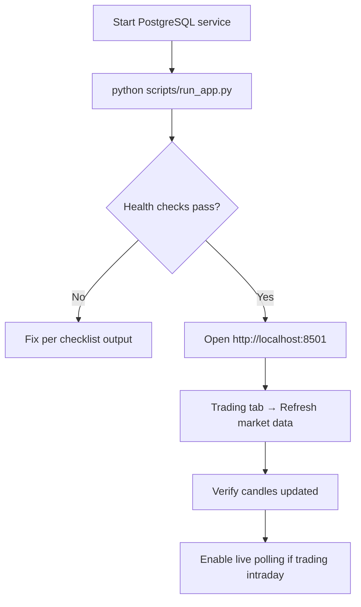

# Operations Runbook

Day-to-day operations, maintenance, and common procedures.

## Daily startup routine



### Checklist command

```bash
python scripts/startup_checklist.py
```

Expected: all required checks pass.

---

## Scheduled / manual jobs

| Job | When | How |
|-----|------|-----|
| **Market sync** | Daily after market close; morning before analysis | UI **Refresh market data** or CLI below |
| **Backtest refresh** | Weekly or after pattern changes | Pattern backtest → Hard refresh |
| **Recommendations** | Each trading morning | Recommendations → Run analysis |
| **EOD review** | After market close | Analysis & EOD tab |

### CLI market sync (cron-friendly)

```bash
cd backend
source .venv/bin/activate
python -m app.jobs.sync_market_data
```

Example cron ( weekdays 4 PM IST ):

```cron
0 16 * * 1-5 cd /path/to/trading/backend && .venv/bin/python -m app.jobs.sync_market_data
```

---

## Market hours reference

| Event | IST time |
|-------|----------|
| Pre-open | 9:00 |
| Market open | 9:15 |
| Market close | 15:30 |
| Live polling active | 9:15 – 16:30 (configurable in `market_calendar.py`) |

Live quote fetching is disabled outside session hours.

---

## Database maintenance

### Backup

```bash
pg_dump -U trading -d trading -F c -f trading_backup_$(date +%Y%m%d).dump
```

### Restore

```bash
pg_restore -U trading -d trading -c trading_backup_20260729.dump
```

### Check migration version

```bash
cd backend
.venv/bin/python -m alembic current
.venv/bin/python -m alembic history
```

### Apply pending migrations

```bash
cd backend
.venv/bin/python -m alembic upgrade head
```

---

## Monitoring health

| Check | Command / URL |
|-------|---------------|
| App running | http://localhost:8501 |
| API running | http://localhost:8000/health |
| Postgres | `pg_isready -h localhost -p 5432` |
| Startup checks | `python scripts/startup_checklist.py` |
| Recent errors | `curl localhost:8000/api/admin/audit-logs?status=FAILED&limit=20` |

---

## Common operations

### Reset paper account cash

```sql
UPDATE paper_accounts SET cash_balance = initial_cash WHERE id = 1;
```

### Paper trading history prune

Runs automatically at the end of **Refresh market data** / `sync_latest` after **3:45 PM IST**:

```
ingestion.backfill_candles → paper_trading_retention.prune_paper_trading_history_if_due()
```

Deletes terminal `paper_trade_plans`, `paper_trades`, and unreferenced `paper_orders` older than `PAPER_TRADING_RETENTION_DAYS` (default 30). Active bracket plans are kept.

Schedule via cron for nightly runs (same slots as the UI auto-sync):

```bash
# 3:45 PM IST — post-session OHLC for Analysis tab
45 15 * * 1-5 cd /path/to/trading/backend && .venv/bin/python -m app.jobs.sync_market_data

# 6:00 PM IST — final EOD refresh
0 18 * * 1-5 cd /path/to/trading/backend && .venv/bin/python -m app.jobs.sync_market_data
```

With the Streamlit app open, auto-sync also runs at **3:45 PM** and **6:00 PM IST** without cron.

### Applicable rates refresh

Tax/charge rates (STCG, STT, stamp duty) are refreshed daily:

- **First app start of the day**, or
- **9:00 AM IST** if the app stayed open overnight

```bash
# Optional cron before market open
0 9 * * 1-5 cd /path/to/trading/backend && .venv/bin/python -m app.jobs.refresh_applicable_rates
```

Persisted to `backend/app/data/applicable_rates.json`. Sidebar shows a notice when refresh completes.

---

### Clear all paper trades (destructive)

```sql
TRUNCATE paper_trades, paper_orders, paper_positions, paper_trade_plans CASCADE;
UPDATE paper_accounts SET cash_balance = initial_cash;
```

### Force re-backfill candles

1. Optionally delete stale candles: `DELETE FROM ohlcv_candles WHERE trade_date < CURRENT_DATE - 120;`
2. Run **Refresh market data**

### Clear recommendation cache

```sql
DELETE FROM recommendation_snapshots WHERE analysis_date = '2026-07-29';
```

Then re-run analysis in UI.

### Clear backtest cache

```sql
DELETE FROM backtest_stock_scores;
DELETE FROM backtest_pattern_scores;
DELETE FROM backtest_runs;
```

Then hard refresh on Pattern backtest tab.

---

## Incident response

| Incident | Steps |
|----------|-------|
| **Streamlit won't start** | Check port 8501; run startup checklist; verify venv |
| **Database connection refused** | Start PostgreSQL; verify `DATABASE_URL` |
| **Stale UI after code change** | Restart Streamlit process |
| **ImportError (models / trade_tax / helpers)** | Restart Streamlit; see [Streamlit UI — hot reload](08-streamlit-ui.md) |
| **SQLAlchemy mapper error** (`PaperOrder failed to locate`) | Restart Streamlit; `ensure_models_fresh()` on next load purges ORM registry |
| **`Settings` missing attribute after deploy** | Restart Streamlit; UI falls back to `app.defaults` via `getattr` |
| **`connect() got unexpected keyword argument 'options'`** | Remove `?options=` from `DATABASE_URL` |
| **Audit log flood of `job failed once`** | Test pollution — see [Audit — purging test noise](13-audit-and-observability.md) |
| **NSE sync timeout** | Retry; check internet; NSE may rate-limit |
| **Backtest job stuck** | Restart Streamlit; check audit logs for `job.SIM_BACKTEST` |
| **Positions not auto-sold at 3:25 PM** | Enable **Live polling (10s)** on Positions tab during 9:15–16:30 IST; 3:25 square-off runs only via live polling for bracket plans |
| **Target/stop missed while app offline** | Positions view → **Reconcile brackets**; CLI fallback: `python -m app.jobs.reconcile_session_targets` |
| **Mid-day Place order still active after order** | Refresh page; `_load_midday_place_state()` checks plan levels match mid-day allocation |
| **Chart popup keeps reopening** | Close via **Close** or X — `on_dismiss` clears dialog session state; upgrade if using an older build without open-flag fix |
| **Unexpected same-price buy/sell on Trades tab** | Do not use sidebar **SELL** on Rec symbols; mid-session **Refresh market data** no longer runs stale EOD on prior days — enable live polling for intraday brackets |
| **Rec position won't sell manually** | By design — exits only at target, stop, or 3:25 PM IST |
| **Live polling flicker** | Ensure only Positions fragment reruns (not full page) |
| **Duplicate orders same symbol** | Open Trading → **Orders** tab (auto cleanup); cancel any remaining pending duplicates manually; restart app if UI stale |
| **Many REJECTED SELL rows (same symbol)** | Open **Orders** tab — auto cleanup clears failed bracket exit retries; enable live polling so exits succeed while shares are held |
| **Place trade still shown after order placed** | Refresh page; verify plan exists in DB; check `recommendation_date` vs session date matching in `_load_allocation_trade_plan_state` |
| **Trading tab shows yesterday's picks** | `_ensure_recommendation_session_state()` should reload today's snapshot; run **Run analysis** or wait for EOD cache refresh |

---

## Upgrade procedure

1. Pull latest code
2. `cd backend && .venv/bin/pip install -r ../requirements-migrate.txt -e .`
3. `.venv/bin/python -m alembic upgrade head`
4. `python scripts/startup_checklist.py`
5. `./scripts/run_tests.sh all` (recommended)
6. Restart Streamlit

---

## Performance tips

| Area | Tip |
|------|-----|
| Trading tab | Default load is Positions-only; switch radio views for Orders/Trades/NIFTY250 |
| Backtest | Use cached simulation; open **30-day simulation** section only when needed |
| Recommendations | Use **Stock picks** / **Budget & orders** sections; tier radio loads one group at a time |
| EOD / Paper trend | Click **Refresh** to load reports (not auto-built on first visit) |
| Live polling | Disable when not actively trading |
| Universe size | NIFTY250 is default; smaller universe = faster sync |
| Audit logs | Periodically prune old rows |

---

## File locations quick reference

| What | Where |
|------|-------|
| Environment | `backend/.env` |
| Logs | `audit_logs` table (not files) |
| Migrations | `backend/alembic/versions/` |
| Pattern data | `backend/app/data/` |
| Test runner | `backend/scripts/run_tests.sh` |
| Setup | `Setup.py` (repo root) |

Next: [Sharekhan integration](16-sharekhan-integration.md)
