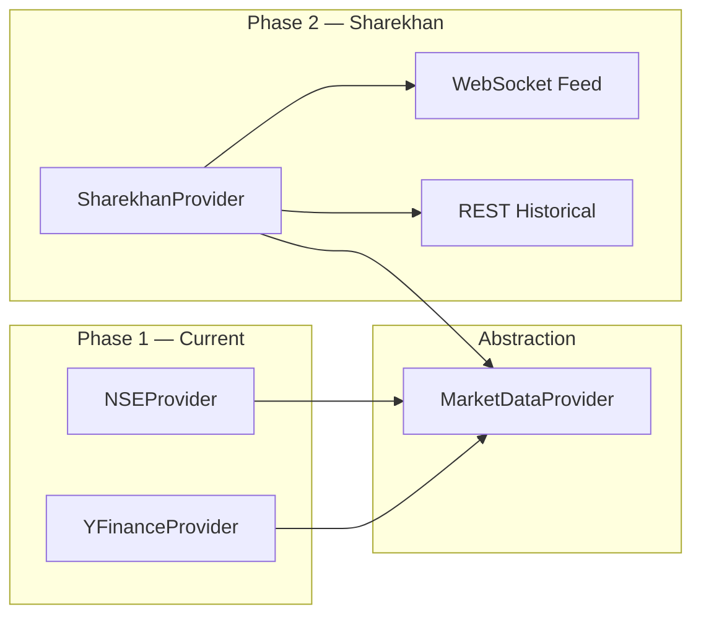

# Sharekhan Integration (Phase 2)

Roadmap for replacing NSE/yfinance with Sharekhan broker API.

## Current state

| Provider | Status | Used for |
|----------|--------|----------|
| **NSE** (`nsefeed`) | ✅ Active (default) | EOD candles, live quotes |
| **yfinance** | ✅ Active (fallback) | Index data when NSE unavailable |
| **Sharekhan** | ⏳ Stub | Not implemented |

**Stub file:** `backend/app/providers/sharekhan_provider.py` — all methods raise `NotImplementedError`

**Factory:** `get_market_data_provider()` selects Sharekhan when `DATA_PROVIDER=sharekhan` and credentials are set.

---

## Why Sharekhan?

- Official broker data aligned with your trading account
- Real-time WebSocket feeds for intraday paper trading
- Historical data from broker (when API access enabled)
- Future path to live trading (outside current scope)

---

## Prerequisites

1. Sharekhan trading account with **API access enabled**
2. API key and customer ID from [Sharekhan Trading API](https://www.sharekhan.com/trading-api/documentation/overview)
3. OAuth flow for access token refresh
4. Official SDK: `pip install shareconnect`

---

## Integration architecture



**No changes required** to paper trading engine, backtest, or UI when switching providers — only the provider implementation.

---

## Required implementation

### 1. Environment configuration

```env
DATA_PROVIDER=sharekhan
SHAREKHAN_API_KEY=your_api_key
SHAREKHAN_CUSTOMER_ID=your_customer_id
SHAREKHAN_ACCESS_TOKEN=your_access_token
```

### 2. Instrument master sync

Implement `sync_instrument_master()`:

- Call Sharekhan `master("NC")` for NSE cash segment
- Map scrip codes → `instruments.sharekhan_scrip_code`
- Update existing rows or insert new instruments

### 3. Historical candles

Implement `fetch_candles()`:

- Call `historicaldata(exchange, scripcode, interval)`
- Map response to `OhlcvCandle` format (OHLCV + trade_date)
- Replace NSE BhavCopy as primary EOD source

### 4. Live quotes

Implement `fetch_latest_quotes()`:

- WebSocket subscription for LTP
- Used by live polling and MARKET order fills
- Fallback to REST quote API if WebSocket unavailable

### 5. OAuth / token refresh

- Login flow for access token generation
- Token refresh before expiry
- Store token securely in `.env` or encrypted store

---

## Abstract provider interface

**File:** `backend/app/providers/base.py`

| Method | Purpose |
|--------|---------|
| `fetch_candles(symbol, start, end)` | Historical OHLCV |
| `fetch_latest_quotes(symbols)` | Current LTP map |
| `sync_instrument_master()` | Symbol ↔ scrip code mapping |

All three must be implemented in `SharekhanProvider`.

---

## Data mapping

| Internal | Sharekhan |
|----------|-----------|
| `instruments.symbol` | Trading symbol |
| `instruments.sharekhan_scrip_code` | Scrip code from master |
| `ohlcv_candles.trade_date` | Candle date |
| `ohlcv_candles.source` | Set to `sharekhan` |

---

## Testing strategy

1. Unit tests with mocked Sharekhan responses
2. Integration test: fetch candles for one symbol (TCS)
3. Compare OHLCV against NSE provider for validation period
4. Live quote test during market hours
5. Full sync job end-to-end

---

## Rollback plan

Set `DATA_PROVIDER=nse` in `.env` and restart — instant fallback to NSE provider with no schema changes.

---

## Out of scope (Phase 2+)

| Feature | Notes |
|---------|-------|
| Live order placement to broker | Paper trading only today |
| Portfolio sync from broker | Manual paper account |
| Options/F&O instruments | Equity cash segment only |
| Multi-broker support | Single provider at a time |

---

## Reference links

- [Sharekhan Trading API Overview](https://www.sharekhan.com/trading-api/documentation/overview)
- Provider stub: `backend/app/providers/sharekhan_provider.py`
- Config: `backend/app/config.py` (Sharekhan credential fields)

Return to [Documentation index](README.md)
