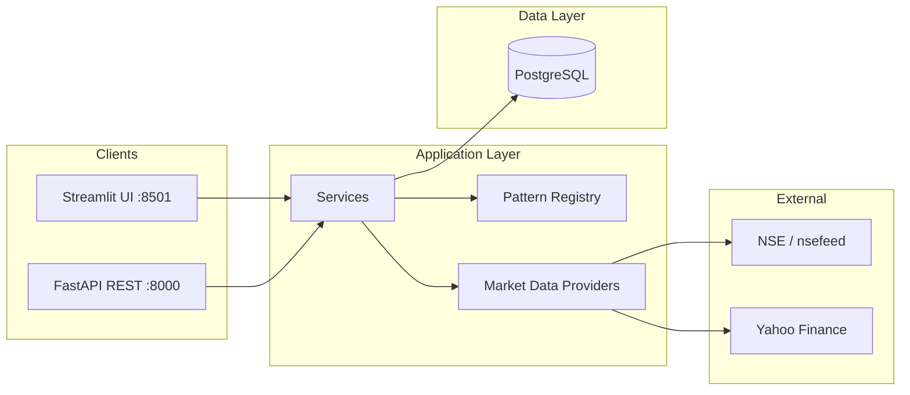

# Project Architecture Documentation

Complete technical documentation for the **NIFTY Paper Trading Simulation Platform** — a Python + PostgreSQL + Streamlit application for NIFTY index and constituent paper trading, pattern backtesting, and daily recommendations.

## Documentation index

| # | Document | Description |
|---|----------|-------------|
| 1 | [Prerequisites](01-prerequisites.md) | Software, hardware, network, and account requirements |
| 2 | [Installation guide](02-installation.md) | Step-by-step setup on macOS, Linux, and Windows |
| 3 | [Architecture overview](03-architecture-overview.md) | System layers, components, deployment topology |
| 4 | [Data model](04-data-model.md) | PostgreSQL schema, entities, relationships, migrations |
| 5 | [Data flows](05-data-flows.md) | End-to-end flows with sequence and flow diagrams |
| 6 | [Services reference](06-services-reference.md) | Business logic modules and responsibilities |
| 7 | [API reference](07-api-reference.md) | FastAPI REST endpoints (optional API layer) |
| 8 | [Streamlit UI](08-streamlit-ui.md) | Dashboard pages, jobs, session state, live polling |
| 9 | [Configuration](09-configuration.md) | Environment variables, defaults, universes |
| 10 | [Patterns & backtesting](10-patterns-and-backtesting.md) | Pattern registry, scoring, simulation cache |
| 11 | [Paper trading & brackets](11-paper-trading-and-brackets.md) | Orders, positions, trade plans, EOD/live fills |
| 12 | [Recommendations engine](12-recommendations-engine.md) | Ranking, budget allocation, budget simulation, snapshot cache |
| 13 | [Audit & observability](13-audit-and-observability.md) | Audit logs, middleware, troubleshooting |
| 14 | [Testing & CI](14-testing-and-ci.md) | Pytest suite, markers, GitLab/GitHub pipelines |
| 15 | [Operations runbook](15-operations-runbook.md) | Daily startup, sync jobs, backups, common issues |
| 16 | [Sharekhan integration](16-sharekhan-integration.md) | Phase 2 provider swap-in roadmap |

## Related docs (outside this folder)

| Document | Location |
|----------|----------|
| Windows / Cursor migration | [../MIGRATION.md](../MIGRATION.md) |
| PyCharm Community setup | [../PYCHARM.md](../PYCHARM.md) |
| Project README (quick start) | [../../README.md](../../README.md) |

## Quick reference

```text
trading/                          ← open this folder as workspace root
├── Setup.py                      ← one-time migration setup
├── scripts/run_app.py            ← startup checks + Streamlit
├── backend/
│   ├── app/                      ← FastAPI, models, services, providers
│   ├── ui/dashboard.py           ← Streamlit entry (port 8501)
│   ├── alembic/                  ← database migrations (001–007)
│   └── tests/                    ← integration + post-deploy tests
└── docs/project-architecture/    ← you are here
```

## At a glance



**Primary entry point:** `python scripts/run_app.py` → http://localhost:8501

**Required service:** PostgreSQL 15+ on `localhost:5432`
